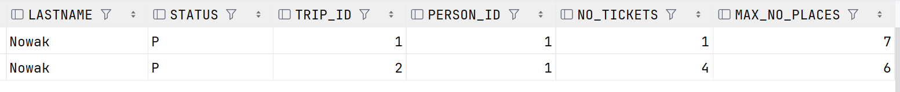

# Oracle PL/Sql

widoki, funkcje, procedury, triggery
ćwiczenie

---


Imiona i nazwiska autorów :

---
<style>
  {
    font-size: 16pt;
  }
</style> 

<style scoped>
 li, p {
    font-size: 14pt;
  }
</style> 

<style scoped>
 pre {
    font-size: 10pt;
  }
</style> 

# Tabele


- `Trip`  - wycieczki
	- `trip_id` - identyfikator, klucz główny
	- `trip_name` - nazwa wycieczki
	- `country` - nazwa kraju
	- `trip_date` - data
	- `max_no_places` -  maksymalna liczba miejsc na wycieczkę
- `Person` - osoby
	- `person_id` - identyfikator, klucz główny
	- `firstname` - imię
	- `lastname` - nazwisko


- `Reservation`  - rezerwacje/bilety na wycieczkę
	- `reservation_id` - identyfikator, klucz główny
	- `trip_id` - identyfikator wycieczki
	- `person_id` - identyfikator osoby
	- `status` - status rezerwacji
		- `N` – New - Nowa
		- `P` – Confirmed and Paid – Potwierdzona  i zapłacona
		- `C` – Canceled - Anulowana
- `Log` - dziennik zmian statusów rezerwacji 
	- `log_id` - identyfikator, klucz główny
	- `reservation_id` - identyfikator rezerwacji
	- `log_date` - data zmiany
	- `status` - status


```sql
create sequence s_person_seq  
   start with 1  
   increment by 1;

create table person  
(  
  person_id int not null
      constraint pk_person  
         primary key,
  firstname varchar(50),  
  lastname varchar(50)
)  

alter table person  
    modify person_id int default s_person_seq.nextval;
   
```


```sql
create sequence s_trip_seq  
   start with 1  
   increment by 1;

create table trip  
(  
  trip_id int  not null
     constraint pk_trip  
         primary key, 
  trip_name varchar(100),  
  country varchar(50),  
  trip_date date,  
  max_no_places int
);  

alter table trip 
    modify trip_id int default s_trip_seq.nextval;
```


```sql
create sequence s_reservation_seq  
   start with 1  
   increment by 1;

create table reservation  
(  
  reservation_id int not null
      constraint pk_reservation  
         primary key, 
  trip_id int,  
  person_id int,  
  status char(1)
);  

alter table reservation 
    modify reservation_id int default s_reservation_seq.nextval;


alter table reservation  
add constraint reservation_fk1 foreign key  
( person_id ) references person ( person_id ); 
  
alter table reservation  
add constraint reservation_fk2 foreign key  
( trip_id ) references trip ( trip_id );  
  
alter table reservation  
add constraint reservation_chk1 check  
(status in ('N','P','C'));

```


```sql
create sequence s_log_seq  
   start with 1  
   increment by 1;


create table log  
(  
    log_id int not null
         constraint pk_log  
         primary key,
    reservation_id int not null,  
    log_date date not null,  
    status char(1)
);  

alter table log 
    modify log_id int default s_log_seq.nextval;
  
alter table log  
add constraint log_chk1 check  
(status in ('N','P','C')) enable;
  
alter table log  
add constraint log_fk1 foreign key  
( reservation_id ) references reservation ( reservation_id );
```


---
# Dane


Należy wypełnić  tabele przykładowymi danymi 
- 4 wycieczki
- 10 osób
- 10  rezerwacji

Dane testowe powinny być różnorodne (wycieczki w przyszłości, wycieczki w przeszłości, rezerwacje o różnym statusie itp.) tak, żeby umożliwić testowanie napisanych procedur.

W razie potrzeby należy zmodyfikować dane tak żeby przetestować różne przypadki.


```sql
-- trip
insert into trip(trip_name, country, trip_date, max_no_places)  
values ('Wycieczka do Paryza', 'Francja', to_date('2023-09-12', 'YYYY-MM-DD'), 3);  
  
insert into trip(trip_name, country, trip_date,  max_no_places)  
values ('Piekny Krakow', 'Polska', to_date('2025-05-03','YYYY-MM-DD'), 2);  
  
insert into trip(trip_name, country, trip_date,  max_no_places)  
values ('Znow do Francji', 'Francja', to_date('2025-05-01','YYYY-MM-DD'), 2);  
  
insert into trip(trip_name, country, trip_date,  max_no_places)  
values ('Hel', 'Polska', to_date('2025-05-01','YYYY-MM-DD'),  2);

-- person
insert into person(firstname, lastname)  
values ('Jan', 'Nowak');  
  
insert into person(firstname, lastname)  
values ('Jan', 'Kowalski');  
  
insert into person(firstname, lastname)  
values ('Jan', 'Nowakowski');  
  
insert into person(firstname, lastname)  
values  ('Novak', 'Nowak');

-- reservation
-- trip1
insert  into reservation(trip_id, person_id, status)  
values (1, 1, 'P');  
  
insert into reservation(trip_id, person_id, status)  
values (1, 2, 'N');  
  
-- trip 2  
insert into reservation(trip_id, person_id, status)  
values (2, 1, 'P');  
  
insert into reservation(trip_id, person_id, status)  
values (2, 4, 'C');  
  
-- trip 3  
insert into reservation(trip_id, person_id, status)  
values (2, 4, 'P');
```

proszę pamiętać o zatwierdzeniu transakcji

---
# Zadanie 0 - modyfikacja danych, transakcje

Należy zmodyfikować model danych tak żeby rezerwacja mogła dotyczyć kilku miejsc/biletów na wycieczkę
- do tabeli trip należy dodać pole
	- no_tickets
- do tabeli log należy dodac pole
	- no_tickets
	
Należy zmodyfikować zestaw danych testowych

Należy przeprowadzić kilka eksperymentów związanych ze wstawianiem, modyfikacją i usuwaniem danych
oraz wykorzystaniem transakcji

Skomentuj dzialanie transakcji. Jak działa polecenie `commit`, `rollback`?.
Co się dzieje w przypadku wystąpienia błędów podczas wykonywania transakcji? Porównaj sposób programowania operacji wykorzystujących transakcje w Oracle PL/SQL ze znanym ci systemem/językiem MS Sqlserver T-SQL

pomocne mogą być materiały dostępne tu:
https://upel.agh.edu.pl/mod/folder/view.php?id=311899
w szczególności dokument: `1_ora_modyf.pdf`

# Zadanie 0 - rozwiązanie

## Modyfikacja modelu danych

Dodałem kolumnę no_tickets z checkiem > 0:
```sql
alter table reservation
add no_tickets int;

alter table reservation
add constraint reservation_no_tickets_chk check
(no_tickets > 0);

alter table log
add no_tickets int;

alter table log
add constraint log_no_tickets_chk check
(no_tickets > 0);
```

## Modyfikacja danych wejściowych

- pierwsza wycieczka ma dwie rezerwacje i dostepne wolne miejsca, ale jest w przeszłości
- druga nie ma wolnych miejsc i jest w przyszłości
- trzecia ma wolne miejsca i jest w przyszłości
- czwarta jest w przyszłości i nie ma żadnych rezerwacji

Dodawanie no_tickets zrobiłem za pomocą update:
```sql
set transaction read write;

update reservation
set no_tickets = 1
where reservation_id in (1, 6);

update reservation
set no_tickets = 2
where reservation_id in (2, 5, 8);

update reservation
set no_tickets = 3
where reservation_id in (4, 9);

update reservation
set no_tickets = 4
where reservation_id in (3, 7, 10);

commit;
```

Screenshoty danych:
- tabela person 
- tabela trip 
- tabela reservation 

## Eksperymenty z danymi i transakcjami

- Rollback transakcji
```sql
set transaction read write;

update reservation
set no_tickets = 14
where reservation_id = 6;

rollback;
```
Tabela nie została zaktualizowana więc rollback działa
- Błąd podczas transakcji (ujemna wartość no_tickets)
```sql
set transaction read write;

update reservation
set no_tickets = 12
where reservation_id = 6;

update reservation
set no_tickets = -1
where reservation_id = 5;

commit;
```
Podczas wykonywania tej transakcji DataGrip pokazuje błąd:

Po kliknieciu `Stop` następuje rollback transakcji (pierwsza część zapytania nie ma efektu)
- Wstawianie i usuwanie danych
```sql
insert into person (firstname, lastname)
values ('Janusz', 'Balicki');

delete from person
where firstname = 'Janusz' and lastname = 'Balicki';
```
Oba zapytania działają

## Jak działa commit i rollback?

Commit zatwierdza transakcję, modyfikacje zostają zapisane w bazie danych.
Rollback anuluje transakcję i sprawia, że żadne zmiany w transakcji nie zostają zapisane. W przypadku błędu podczas transakcji, można kliknąć `Stop` w DataGripie i wykonany zostanie rollback.

## Transakcje w PL/SQL vs T-SQL

Transakcje wydają się bardzo podobne w obu językach, różnica jaką zauważyłem to możliwość zignorowania błędu w transakcji za pomocą DataGripa w PL/SQL, a z tego co pamiętam w T-SQL nie wyświetlała się taka możliwość.

---
# Zadanie 1 - widoki


Tworzenie widoków. Należy przygotować kilka widoków ułatwiających dostęp do danych. Należy zwrócić uwagę na strukturę kodu (należy unikać powielania kodu)

Widoki:
-   `vw_reservation`
	- widok łączy dane z tabel: `trip`,  `person`,  `reservation`
	- zwracane dane:  `reservation_id`,  `country`, `trip_date`, `trip_name`, `firstname`, `lastname`, `status`, `trip_id`, `person_id`, `no_tickets`
- `vw_trip` 
	- widok pokazuje liczbę wolnych miejsc na każdą wycieczkę
	- zwracane dane: `trip_id`, `country`, `trip_date`, `trip_name`, `max_no_places`, `no_available_places` (liczba wolnych miejsc)
-  `vw_available_trip`
	- podobnie jak w poprzednim punkcie, z tym że widok pokazuje jedynie dostępne wycieczki (takie które są w przyszłości i są na nie wolne miejsca)


Proponowany zestaw widoków można rozbudować wedle uznania/potrzeb
- np. można dodać nowe/pomocnicze widoki, funkcje
- np. można zmienić def. widoków, dodając nowe/potrzebne pola

# Zadanie 1  - rozwiązanie

## vw_reservation
```sql
create or replace view vw_reservation
as
select reservation_id, country, trip_date, trip_name,
       firstname, lastname, status, r.trip_id,
       r.person_id, no_tickets, max_no_places
from reservation r
join trip t on t.trip_id = r.trip_id
join person p on p.person_id = r.person_id;
```
Wynik:


## vw_trip
Wykorzystałem tu widok `vw_reservation`. Ze względu na to, że mogą być wycieczki bez rezerwacji używam `left join` i `nvl(sum(no_tickets), 0)`, które zmienia `null` na zero. Ignoruję rezerwacje ze statusem `C` - Cancelled. Dodałem kolumnę `no_available_places` na potrzeby kolejnych zadań.
```sql
create or replace view vw_trip
as
select t.trip_id, t.country, t.trip_date, t.trip_name, t.max_no_places,
       t.max_no_places - nvl(sum(no_tickets), 0) as no_available_places
from trip t
left join vw_reservation vr on vr.trip_id = t.trip_id
where status != 'C' or vr.trip_id is null
group by t.trip_id, t.country, t.trip_date, t.trip_name, t.max_no_places;
```
Wynik:


## vw_available_trip
Wykorzystałem tu widok ```vw_trip```. Ignoruję rekordy w których `no_available_places = 0` oraz wycieczki, które już się odbyły za pomocą porównania daty z `sysdate`
```sql
create or replace view vw_available_trip
as
select * from vw_trip
where no_available_places > 0 and trip_date > sysdate;
```
Wynik:


---
# Zadanie 2  - funkcje


Tworzenie funkcji pobierających dane/tabele. Podobnie jak w poprzednim przykładzie należy przygotować kilka funkcji ułatwiających dostęp do danych

Procedury:
- `f_trip_participants`
	- zadaniem funkcji jest zwrócenie listy uczestników wskazanej wycieczki
	- parametry funkcji: `trip_id`
	- funkcja zwraca podobny zestaw danych jak widok  `vw_eservation`
-  `f_person_reservations`
	- zadaniem funkcji jest zwrócenie listy rezerwacji danej osoby 
	- parametry funkcji: `person_id`
	- funkcja zwraca podobny zestaw danych jak widok `vw_reservation`
-  `f_available_trips_to`
	- zadaniem funkcji jest zwrócenie listy wycieczek do wskazanego kraju, dostępnych w zadanym okresie czasu (od `date_from` do `date_to`)
	- parametry funkcji: `country`, `date_from`, `date_to`


Funkcje powinny zwracać tabelę/zbiór wynikowy. Należy rozważyć dodanie kontroli parametrów, (np. jeśli parametrem jest `trip_id` to można sprawdzić czy taka wycieczka istnieje). Podobnie jak w przypadku widoków należy zwrócić uwagę na strukturę kodu

Czy kontrola parametrów w przypadku funkcji ma sens?
- jakie są zalety/wady takiego rozwiązania?

Proponowany zestaw funkcji można rozbudować wedle uznania/potrzeb
- np. można dodać nowe/pomocnicze funkcje/procedury

# Zadanie 2  - rozwiązanie

W funkcjach dodaję `_` na koniec nazw niektórych argumentów ze względu na konflikty nazw. Wiem, że można też pisać nazwę funkcji, ale uznałem, że dodanie `_` jest wygodniejsze i czytelne. 

Na potrzeby tego zadania zdefiniowałem typy pomocnicze:
- t_trip i t_trip_table
```sql
create or replace type t_trip as object
(
    trip_id int,
    trip_name varchar(100),
    country varchar(50),
    trip_date date,
    max_no_places int,
    no_available_places int
);

create or replace type t_trip_table as table of t_trip;
```
- t_trip_participant oraz t_trip_participant_table
```sql
create or replace type t_trip_participant as object
(
    reservation_id int,
    country varchar(50),
    trip_date date,
    trip_name varchar(100),
    firstname varchar(50),
    lastname varchar(50),
    status char(1),
    trip_id int,
    person_id int,
    no_tickets int,
    max_no_places int
);

create or replace type t_trip_participant_table is table of t_trip_participant;
```
oraz funkcje pomocnicze:
- `f_person_exists` - zwraca true jeśli dana osoba istnieje
```sql
create or replace function f_person_exists(person_id_ int)
    return boolean
as
    person_exists int;
begin
    select count(*) into person_exists
    from person
    where person_id = person_id_;

    return person_exists = 1;
end;
```
- `f_trip_exists` - zwraca true jeśli dana wycieczka istnieje
```sql
create or replace function f_trip_exists(trip_id_ int)
    return boolean
as
    trip_exists int;
begin
    select count(*) into trip_exists
    from trip
    where trip_id = trip_id_;

    return trip_exists = 1;
end;
```

## f_trip_participants 
W tej funkcji sprawdzam parametr `trip_id` - ma to sens ponieważ podanie złego id wskazuje na błąd w kodzie. Dzięki temu zwrócenie pustej tabeli jednoznacznie oznacza, że wycieczka nie ma rezerwacji ale istnieje w bazie danych.
```sql
create or replace function f_trip_participants(trip_id_ int)
    return t_trip_participant_table
as
    result t_trip_participant_table;
begin
    if not f_trip_exists(trip_id_) then
        raise_application_error(-20001, 'trip not found');
    end if;

    select t_trip_participant(reservation_id, country, trip_date, trip_name,
       firstname, lastname, status, trip_id,
       person_id, no_tickets, max_no_places)
    bulk collect
    into result
    from vw_reservation
    where trip_id = trip_id_ and
          status != 'C';
    return result;
end;
```
Przykładowy wynik (dla `select * from f_trip_participants(2);`):


## f_person_reservations
W tej funkcji sprawdzam parametr `person_id` - ma to sens ponieważ podanie złego id znów wskazuje na błąd w kodzie. Dzięki temu zwrócenie pustej tabeli jednoznacznie oznacza, że osoba nie ma rezerwacji, ale istnieje w bazie danych.
```sql
create or replace function f_person_reservations(person_id_ int)
    return t_trip_participant_table
as
    result t_trip_participant_table;
begin
    if not f_person_exists(person_id_) then
        raise_application_error(-20002, 'person not found');
    end if;

    select t_trip_participant(reservation_id, country, trip_date, trip_name,
       firstname, lastname, status, trip_id,
       person_id, no_tickets, max_no_places)
    bulk collect
    into result
    from vw_reservation
    where person_id = person_id_ and
          status != 'C';
    return result;
end;
```
Przykładowy wynik (dla `select * from f_person_reservations(1);`):



## f_available_trips_to
W tej funkcji sprawdzam czy `data_from < date_to`, ponieważ niespełnienie tego wskazuje na oczywisty błąd. Nie sprawdzam czy istnieją rekordy z danym krajem, bo nie ma tabeli krajów więc uznałem, że nie jest to użyteczne i niekoniecznie oznacza błąd.

```sql
create or replace function f_available_trips_to(country_ varchar2, date_from date, date_to date)
    return t_trip_table
as
    result t_trip_table;
begin
    if date_from >= date_to then
        raise_application_error(-20003, 'date_from must be lesser than date_to');
    end if;

    select t_trip(trip_id, trip_name, country,
                  trip_date, max_no_places, no_available_places)
    bulk collect
    into result
    from vw_available_trip vat
    where country = country_ and
          trip_date >= date_from and
          trip_date <= date_to;
    return result;
end;
```
Przykładowy wynik (dla `select * from f_available_trips_to('Francja', to_date('2024-10-10', 'YYYY-MM-DD'), to_date('2026-10-10', 'YYYY-MM-DD'));`):


---
# Zadanie 3  - procedury


Tworzenie procedur modyfikujących dane. Należy przygotować zestaw procedur pozwalających na modyfikację danych oraz kontrolę poprawności ich wprowadzania

Procedury
- `p_add_reservation`
	- zadaniem procedury jest dopisanie nowej rezerwacji
	- parametry: `trip_id`, `person_id`,  `no_tickets`
	- procedura powinna kontrolować czy wycieczka jeszcze się nie odbyła, i czy sa wolne miejsca
	- procedura powinna również dopisywać inf. do tabeli `log`
- `p_modify_reservation_status
	- zadaniem procedury jest zmiana statusu rezerwacji 
	- parametry: `reservation_id`, `status`
	- procedura powinna kontrolować czy możliwa jest zmiana statusu, np. zmiana statusu już anulowanej wycieczki (przywrócenie do stanu aktywnego nie zawsze jest możliwa – może już nie być miejsc)
	- procedura powinna również dopisywać inf. do tabeli `log`
- `p_modify_reservation
	- zadaniem procedury jest zmiana statusu rezerwacji 
	- parametry: `reservation_id`, `no_iickets`
	- procedura powinna kontrolować czy możliwa jest zmiana liczby sprzedanych/zarezerwowanych biletów – może już nie być miejsc
	- procedura powinna również dopisywać inf. do tabeli `log`
- `p_modify_max_no_places`
	- zadaniem procedury jest zmiana maksymalnej liczby miejsc na daną wycieczkę 
	- parametry: `trip_id`, `max_no_places`
	- nie wszystkie zmiany liczby miejsc są dozwolone, nie można zmniejszyć liczby miejsc na wartość poniżej liczby zarezerwowanych miejsc

Należy rozważyć użycie transakcji

Należy zwrócić uwagę na kontrolę parametrów (np. jeśli parametrem jest trip_id to należy sprawdzić czy taka wycieczka istnieje, jeśli robimy rezerwację to należy sprawdzać czy są wolne miejsca itp..)


Proponowany zestaw procedur można rozbudować wedle uznania/potrzeb
- np. można dodać nowe/pomocnicze funkcje/procedury

# Zadanie 3  - rozwiązanie

Na potrzeby tego zadania dodałem funkcje pomocnicze:
- `f_trip_free_places` - zwraca ilość wolnych miejsc dla danej wycieczki
```sql
create or replace function f_trip_free_places(trip_id_ int)
    return int
as
    free_places int;
begin
    if not f_trip_exists(trip_id_) then
        raise_application_error(-20001, 'trip not found');
    end if;
```
- `f_trip_is_future` - zwraca `true` jeśli wycieczka jeszcze się nie odbyła
```sql
create or replace function f_trip_is_future(trip_id_ int)
    return boolean
as
    is_future int;
begin
    if not f_trip_exists(trip_id_) then
        raise_application_error(-20001, 'trip not found');
    end if;

    select count(*) into is_future
    from vw_trip
    where trip_id = trip_id_ and
          trip_date > sysdate;

    return is_future = 1;
end;
```
- `f_reservation_exists` - zwraca `true` jeśli dana rezerwacja istnieje
```sql
create or replace function f_reservation_exists(reservation_id_ int)
    return boolean
as
    reservation_exists int;
begin
    select count(*) into reservation_exists
    from reservation
    where reservation_id = reservation_id_;

    return reservation_exists = 1;
end;
```

- `f_is_valid_status` - zwraca true jeśli status jest równy 'N', 'P' lub 'C'
```sql
create or replace function f_is_valid_status(status_ char)
    return boolean
as begin
    return status_ in ('N', 'P', 'C');
end;
```
- `f_trip_taken_places` - zwraca ilość zajętych miejsc na podanej wycieczce
```sql
create or replace function f_trip_taken_places(trip_id_ int)
    return int
as
    taken_places int;
begin
    if not f_trip_exists(trip_id_) then
        raise_application_error(-20001, 'trip not found');
    end if;

    select max_no_places - no_available_places into taken_places
    from vw_trip
    where trip_id = trip_id_;

    return taken_places;
end;
```

## p_add_reservation
Sprawdzam czy wycieczka i osoba istnieją (błędy w funkcjach pomocniczych) oraz czy są wolne miejsca i czy wycieczka jest w przyszłości. Użyłem transakcji, aby zachować spójność tabel reservation i log
```sql
create or replace procedure p_add_reservation
    (trip_id_ int, person_id_ int, no_tickets_ int)
as
    reservation_id_ int;
begin
    if f_trip_free_places(trip_id_) < no_tickets_ then
        raise_application_error(-20004, 'trip does not have enough free places');
    end if;

    if not f_trip_is_future(trip_id_) then
        raise_application_error(-20005, 'trip already started/ended');
    end if;

    set transaction read write;
    insert into reservation(trip_id, person_id, status, no_tickets)
    values(trip_id_, person_id_, 'N', no_tickets_)
    return reservation_id into reservation_id_;

    insert into log(reservation_id, log_date, status, no_tickets)
    values (reservation_id_, sysdate, 'N', no_tickets_);

    commit;
end;
```
Po wykonaniu `p_add_reservation(3, 3, 2)` rekord został dodany:

Zostało 0 miejsc w wycieczce 3 zatem wykonaniu `p_add_reservation(3, 4, 1)` otrzymujemy błąd:

Po wykonaniu dla wycieczki 1, która już się zakończyła otrzymujemy błąd:


## p_modify_reservation_status
Sprawdzam istnienie rezerwacji, czy status jest właściwy oraz czy wycieczka ma wystarczająco dużo wolnych miejsc w przypadku zmiany statusu z 'C'. Znów używam transakcji.
```sql
create or replace procedure p_modify_reservation_status
    (reservation_id_ int, status_ char)
as
    cur_status char;
    trip_id_ int;
    no_tickets_ int;
begin
    if not f_reservation_exists(reservation_id_) then
        raise_application_error(-20006, 'reservation not found');
    end if;

    if not f_is_valid_status(status_) then
        raise_application_error(-20007, 'invalid reservation status');
    end if;

    set transaction read write;

    select trip_id, status, no_tickets into trip_id_, cur_status, no_tickets_
    from reservation
    where reservation_id = reservation_id_;

    if cur_status = status_ then
        return;
    end if;

    if cur_status = 'C' and f_trip_free_places(trip_id_) = 0 then
        raise_application_error(-20004, 'trip does not have enough free places');
    end if;

    update reservation
    set status = status_
    where reservation_id = reservation_id_;

    insert into log(reservation_id, log_date, status, no_tickets)
    values (reservation_id_, sysdate, status_, no_tickets_);

    commit;
end;
```
Po wykonaniu `p_modify_reservation_status(5, 'P')` dane zaktualizowane (rezerwacja 5 miała status 'N'):

Po wykonaniu `p_modify_reservation_status(8, 'N')` błąd bo nie ma miejsc, a rezerwacja miała status 'C':


## p_modify_reservation
Sprawdzam istnienie rezerwacji, status i czy wycieczka ma wystarczająco dużo biletów. Znów użyłem transakcji.
```sql
create or replace procedure p_modify_reservation
    (reservation_id_ int, no_tickets_ int)
as
    trip_id_ int;
    status_ char;
    cur_no_tickets int;
begin
    if not f_reservation_exists(reservation_id_) then
        raise_application_error(-20006, 'reservation not found');
    end if;

    set transaction read write;

    select trip_id, status, no_tickets into trip_id_, status_, cur_no_tickets
    from reservation
    where reservation_id = reservation_id_;

    if no_tickets_ = cur_no_tickets then
        return;
    end if;

    if status_ = 'C' then
        raise_application_error(-20008, 'can not modify no_tickets for cancelled reservation');
    end if;

    if f_trip_free_places(trip_id_) < no_tickets_ - cur_no_tickets then
         raise_application_error(-20004, 'trip does not have enough free places');
    end if;

    update reservation
    set no_tickets = no_tickets_
    where reservation_id = reservation_id_;

    insert into log(reservation_id, log_date, status, no_tickets)
    values (reservation_id_, sysdate, status_, no_tickets_);

    commit;
end;
```
Po wywołaniu `p_modify_reservation(9, 1)` (ma status 'P' i 3 bilety) dane zostają zmodyfikowane:

Po wywołaniu `p_modify_reservation(9, 100)` jest błąd:


## p_modify_max_no_places
Sprawdzam czy ilość zajętych miejsc jest mniejsza niż nowy limit
```sql
create or replace procedure p_modify_max_no_places
    (trip_id_ int, max_no_places_ int)
as begin
    if f_trip_taken_places(trip_id_) < max_no_places_ then
        raise_application_error(-20009, 'trip has too many taken places');
    end if;

    update trip
    set max_no_places = max_no_places_
    where trip_id = trip_id_;
end;
```
Po wywołaniu `p_modify_max_no_places(4, 20)` dane zostają zmodyfikowane:

Po wywołaniu `p_modify_max_no_places(3, 1)` jest błąd:


Wszystkie udane transakcje zostały zapisane do tabeli `log`:


---
# Zadanie 4  - triggery


Zmiana strategii zapisywania do dziennika rezerwacji. Realizacja przy pomocy triggerów

Należy wprowadzić zmianę, która spowoduje, że zapis do dziennika będzie realizowany przy pomocy trigerów

Triggery:
- trigger/triggery obsługujące 
	- dodanie rezerwacji
	- zmianę statusu
	- zmianę liczby zarezerwowanych/kupionych biletów
- trigger zabraniający usunięcia rezerwacji

Oczywiście po wprowadzeniu tej zmiany należy "uaktualnić" procedury modyfikujące dane. 

>UWAGA
Należy stworzyć nowe wersje tych procedur (dodając do nazwy dopisek 4 - od numeru zadania). Poprzednie wersje procedur należy pozostawić w celu  umożliwienia weryfikacji ich poprawności

Należy przygotować procedury: `p_add_reservation_4`, `p_modify_reservation_status_4` , `p_modify_reservation_4`


# Zadanie 4  - rozwiązanie

## Trigger obługujący dodanie/modyfikację rezerwacji
```sql
create or replace trigger tr_log_reservation
    after insert or update
    on reservation
    for each row
begin
    insert into log(reservation_id, log_date, status, no_tickets)
    values (:NEW.reservation_id, sysdate, :NEW.status, :NEW.no_tickets);
end;
```

## Trigger zabraniający usunięcia rezerwacji
```sql
create or replace trigger tr_prevent_delete_reservation
    before delete
    on reservation
    for each row
begin
    raise_application_error(-20010, 'deleting reservations is forbidden');
end;
```
Wynik:


## Zmodyfikowane procedury
W procedurach usunąłem inserta do tabeli log
## p_add_reservation_4
Po usunięciu inserta do tabeli log transakcja nie jest potrzebna
```sql
create or replace procedure p_add_reservation_4
    (trip_id_ int, person_id_ int, no_tickets_ int)
as
    reservation_id_ int;
begin
    if f_trip_free_places(trip_id_) < no_tickets_ then
        raise_application_error(-20004, 'trip does not have enough free places');
    end if;

    if not f_trip_is_future(trip_id_) then
        raise_application_error(-20005, 'trip already started/ended');
    end if;

    insert into reservation(trip_id, person_id, status, no_tickets)
    values(trip_id_, person_id_, 'N', no_tickets_)
    return reservation_id into reservation_id_;
end;
```
Po wykonaniu `p_add_reservation(4, 1, 3)` mamy wpis w logu stworzony przez trigger:


## p_modify_reservation_status_4
```sql
create or replace procedure p_modify_reservation_status_4
    (reservation_id_ int, status_ char)
as
    cur_status char;
    trip_id_ int;
    no_tickets_ int;
begin
    if not f_reservation_exists(reservation_id_) then
        raise_application_error(-20006, 'reservation not found');
    end if;

    if not f_is_valid_status(status_) then
        raise_application_error(-20007, 'invalid reservation status');
    end if;

    set transaction read write;

    select trip_id, status, no_tickets into trip_id_, cur_status, no_tickets_
    from reservation
    where reservation_id = reservation_id_;

    if cur_status = status_ then
        return;
    end if;

    if cur_status = 'C' and f_trip_free_places(trip_id_) = 0 then
        raise_application_error(-20004, 'trip does not have enough free places');
    end if;

    update reservation
    set status = status_
    where reservation_id = reservation_id_;

    commit;
end;
```
Po wykonaniu `p_modify_reservation_status_4(23, 'C')` mamy wpis w logu:


## p_modify_reservation_4
```sql
create or replace procedure p_modify_reservation_4
    (reservation_id_ int, no_tickets_ int)
as
    trip_id_ int;
    status_ char;
    cur_no_tickets int;
begin
    if not f_reservation_exists(reservation_id_) then
        raise_application_error(-20006, 'reservation not found');
    end if;

    set transaction read write;

    select trip_id, status, no_tickets into trip_id_, status_, cur_no_tickets
    from reservation
    where reservation_id = reservation_id_;

    if no_tickets_ = cur_no_tickets then
        return;
    end if;

    if status_ = 'C' then
        raise_application_error(-20008, 'can not modify no_tickets for cancelled reservation');
    end if;

    if f_trip_free_places(trip_id_) < no_tickets_ - cur_no_tickets then
         raise_application_error(-20004, 'trip does not have enough free places');
    end if;

    update reservation
    set no_tickets = no_tickets_
    where reservation_id = reservation_id_;

    commit;
end;
```
Po wywołaniu `p_modify_reservation_4(4, 1)` mamy wpis w logu:


---
# Zadanie 5  - triggery


Zmiana strategii kontroli dostępności miejsc. Realizacja przy pomocy triggerów

Należy wprowadzić zmianę, która spowoduje, że kontrola dostępności miejsc na wycieczki (przy dodawaniu nowej rezerwacji, zmianie statusu) będzie realizowana przy pomocy trigerów

Triggery:
- Trigger/triggery obsługujące: 
	- dodanie rezerwacji
	- zmianę statusu
	- zmianę liczby zakupionych/zarezerwowanych miejsc/biletów

Oczywiście po wprowadzeniu tej zmiany należy "uaktualnić" procedury modyfikujące dane. 

>UWAGA
Należy stworzyć nowe wersje tych procedur (np. dodając do nazwy dopisek 5 - od numeru zadania). Poprzednie wersje procedur należy pozostawić w celu  umożliwienia weryfikacji ich poprawności. 

Należy przygotować procedury: `p_add_reservation_5`, `p_modify_reservation_status_5`, `p_modify_reservation_status_5`


# Zadanie 5  - rozwiązanie

Obliczam zmianę w ilości miejsc używając zmiennej taken_places_change i potem sprawdzam czy jest wystarczająco dużo miejsc

```sql
create or replace trigger tr_check_places_availability
    before insert or update
    on reservation
    for each row
declare
    taken_places_change int := 0;
    max_no_places_ int;
begin
    select max_no_places into max_no_places_
    from trip t
    where t.trip_id = :NEW.trip_id;

    if :NEW.status != 'C' then
        taken_places_change := taken_places_change + :NEW.no_tickets;
    end if;

    if updating and :OLD.status != 'C' then
        taken_places_change := taken_places_change - :OLD.no_tickets;
    end if;

    if taken_places_change + f_trip_taken_places(:NEW.trip_id) > max_no_places_ then
        raise_application_error(-20004, 'trip does not have enough free places');
    end if;
end;
```

## Zmodyfikowane procedury
W procedurach usunąłem wywołanie funkcji sprawdzającej ilość miejsc 

## p_add_reservation_5
```sql
create or replace procedure p_add_reservation_5
    (trip_id_ int, person_id_ int, no_tickets_ int)
as
    reservation_id_ int;
begin
    if not f_trip_is_future(person_id_) then
        raise_application_error(-20005, 'trip already started/ended');
    end if;

    insert into reservation(trip_id, person_id, status, no_tickets)
    values(trip_id_, person_id_, 'N', no_tickets_)
    return reservation_id into reservation_id_;
end;
```
Po wywołaniu `p_add_reservation(3, 1, 100)` dostajemy błąd:


## p_modify_reservation_status_5
```sql
create or replace procedure p_modify_reservation_status_5
    (reservation_id_ int, status_ char(1))
as
    cur_status char(1);
    trip_id_ int;
    no_tickets_ int;
begin
    if not f_reservation_exists(reservation_id_) then
        raise_application_error(-20006, 'reservation not found');
    end if;

    if not f_is_valid_status(status_) then
        raise_application_error(-20007, 'invalid reservation status');
    end if;

    set transaction read write;

    select trip_id, status, no_tickets into trip_id_, cur_status, no_tickets_
    from reservation
    where reservation_id = reservation_id_;

    if cur_status = status_ then
        return;
    end if;

    update reservation
    set status = status_
    where reservation_id = reservation_id_;

    commit;
end;
```
Po wykonaniu `p_modify_reservation_status_5(8, 'P')` dostajemy błąd z triggera:


## p_modify_reservation_5
```sql
create or replace procedure p_modify_reservation_5
    (reservation_id_ int, no_tickets_ int)
as
    trip_id_ int;
    status_ char(1);
    cur_no_tickets int;
begin
    if not f_reservation_exists(reservation_id_) then
        raise_application_error(-20006, 'reservation not found');
    end if;

    set transaction read write;

    select trip_id, status, no_tickets into trip_id_, status_, cur_no_tickets
    from reservation
    where reservation_id = reservation_id_;

    if no_tickets_ = cur_no_tickets then
        return;
    end if;

    if status_ = 'C' then
        raise_application_error(-20008, 'can not modify no_tickets for cancelled reservation');
    end if;

    update reservation
    set no_tickets = no_tickets_
    where reservation_id = reservation_id_;

    commit;
end;
```
Po wywołaniu `p_modify_reservation(1, 100)` dostajemy błąd:


---
# Zadanie 6


Zmiana struktury bazy danych. W tabeli `trip`  należy dodać  redundantne pole `no_available_places`.  Dodanie redundantnego pola uprości kontrolę dostępnych miejsc, ale nieco skomplikuje procedury dodawania rezerwacji, zmiany statusu czy też zmiany maksymalnej liczby miejsc na wycieczki.

Należy przygotować polecenie/procedurę przeliczającą wartość pola `no_available_places` dla wszystkich wycieczek (do jednorazowego wykonania)

Obsługę pola `no_available_places` można zrealizować przy pomocy procedur lub triggerów

Należy zwrócić uwagę na spójność rozwiązania.

>UWAGA
Należy stworzyć nowe wersje tych widoków/procedur/triggerów (np. dodając do nazwy dopisek 6 - od numeru zadania). Poprzednie wersje procedur należy pozostawić w celu  umożliwienia weryfikacji ich poprawności. 


- zmiana struktury tabeli

```sql
alter table trip add  
    no_available_places int null
```

- polecenie przeliczające wartość `no_available_places`
	- należy wykonać operację "przeliczenia"  liczby wolnych miejsc i aktualizacji pola  `no_available_places`

# Zadanie 6  - rozwiązanie

Do wypełnienia nowej kolumny użyłem widoku `vw_trip`:
```sql
update trip t
set no_available_places = (select v.no_available_places from vw_trip v where v.trip_id = t.trip_id)
where 1 = 1;
```

---
# Zadanie 6a  - procedury


Obsługę pola `no_available_places` należy zrealizować przy pomocy procedur
- procedura dodająca rezerwację powinna aktualizować pole `no_available_places` w tabeli trip
- podobnie procedury odpowiedzialne za zmianę statusu oraz zmianę maksymalnej liczby miejsc na wycieczkę
- należy przygotować procedury oraz jeśli jest to potrzebne, zaktualizować triggery oraz widoki


>UWAGA
Należy stworzyć nowe wersje tych widoków/procedur/triggerów (np. dodając do nazwy dopisek 6a - od numeru zadania). Poprzednie wersje procedur należy pozostawić w celu  umożliwienia weryfikacji ich poprawności. 
- może  być potrzebne wyłączenie 'poprzednich wersji' triggerów 


# Zadanie 6a  - rozwiązanie

## p_add_reservation_6
Dodałem update do tabeli trip
```sql
create or replace procedure p_add_reservation_6
    (trip_id_ int, person_id_ int, no_tickets_ int)
as
    reservation_id_ int;
begin
    if f_trip_free_places(trip_id_) < no_tickets_ then
        raise_application_error(-20004, 'trip does not have enough free places');
    end if;

    if not f_trip_is_future(trip_id_) then
        raise_application_error(-20005, 'trip already started/ended');
    end if;

    set transaction read write;
    insert into reservation(trip_id, person_id, status, no_tickets)
    values(trip_id_, person_id_, 'N', no_tickets_)
    return reservation_id into reservation_id_;

    update trip
    set no_available_places = no_available_places - no_tickets_
    where trip_id = trip_id_;

    insert into log(reservation_id, log_date, status, no_tickets)
    values (reservation_id_, sysdate, 'N', no_tickets_);

    commit;
end;
```

## p_modify_reservation_status_6
Dodawanie lub odejmowanie w trip zależne od statusu
```sql
create or replace procedure p_modify_reservation_status_6
    (reservation_id_ int, status_ char)
as
    cur_status char;
    trip_id_ int;
    no_tickets_ int;
begin
    if not f_reservation_exists(reservation_id_) then
        raise_application_error(-20006, 'reservation not found');
    end if;

    if not f_is_valid_status(status_) then
        raise_application_error(-20007, 'invalid reservation status');
    end if;

    set transaction read write;

    select trip_id, status, no_tickets into trip_id_, cur_status, no_tickets_
    from reservation
    where reservation_id = reservation_id_;

    if cur_status = status_ then
        return;
    end if;

    if cur_status = 'C' and f_trip_free_places(trip_id_) = 0 then
        raise_application_error(-20004, 'trip does not have enough free places');
    end if;

    if cur_status = 'C' then
        update trip
        set no_available_places = no_available_places + no_tickets_
        where trip_id = trip_id_;
    elsif status_ = 'C' then
        update trip
        set no_available_places = no_available_places - no_tickets_
        where trip_id = trip_id_;
    end if;


    update reservation
    set status = status_
    where reservation_id = reservation_id_;

    insert into log(reservation_id, log_date, status, no_tickets)
    values (reservation_id_, sysdate, status_, no_tickets_);

    commit;
end;
```

## p_modify_reservation_6
Update z różnicą biletów
```sql
create or replace procedure p_modify_reservation_6
    (reservation_id_ int, no_tickets_ int)
as
    trip_id_ int;
    status_ char;
    cur_no_tickets int;
begin
    if not f_reservation_exists(reservation_id_) then
        raise_application_error(-20006, 'reservation not found');
    end if;

    set transaction read write;

    select trip_id, status, no_tickets into trip_id_, status_, cur_no_tickets
    from reservation
    where reservation_id = reservation_id_;

    if no_tickets_ = cur_no_tickets then
        return;
    end if;

    if status_ = 'C' then
        raise_application_error(-20008, 'can not modify no_tickets for cancelled reservation');
    end if;

    if f_trip_free_places(trip_id_) < no_tickets_ - cur_no_tickets then
         raise_application_error(-20004, 'trip does not have enough free places');
    end if;

    update trip
    set no_available_places = no_available_places - no_tickets_ + cur_no_tickets
    where trip_id = trip_id_;

    update reservation
    set no_tickets = no_tickets_
    where reservation_id = reservation_id_;

    insert into log(reservation_id, log_date, status, no_tickets)
    values (reservation_id_, sysdate, status_, no_tickets_);

    commit;
end;
```


---
# Zadanie 6b -  triggery


Obsługę pola `no_available_places` należy zrealizować przy pomocy triggerów
- podczas dodawania rezerwacji trigger powinien aktualizować pole `no_available_places` w tabeli trip
- podobnie, podczas zmiany statusu rezerwacji
- należy przygotować trigger/triggery oraz jeśli jest to potrzebne, zaktualizować procedury modyfikujące dane oraz widoki


>UWAGA
Należy stworzyć nowe wersje tych widoków/procedur/triggerów (np. dodając do nazwy dopisek 6b - od numeru zadania). Poprzednie wersje procedur należy pozostawić w celu  umożliwienia weryfikacji ich poprawności. 
- może  być potrzebne wyłączenie 'poprzednich wersji' triggerów 


# Zadanie 6b  - rozwiązanie
Trigger ustala zmianę w ilości rezerwacji za pomocą zmiennej taken_places_change po czym wykonuje update
```sql
create or replace trigger tr_update_no_available_places
    before insert or update
    on reservation
    for each row
declare
    taken_places_change int;
begin
    taken_places_change := 0;

    if :NEW.status != 'C' then
        taken_places_change := taken_places_change + :NEW.no_tickets;
    end if;

    if updating and :OLD.status != 'C' then
        taken_places_change := taken_places_change - :OLD.no_tickets;
    end if;

    update trip
    set no_available_places = no_available_places - taken_places_change
    where trip_id = trip_id_;

end;
```


# Zadanie 7 - podsumowanie

Porównaj sposób programowania w systemie Oracle PL/SQL ze znanym ci systemem/językiem MS Sqlserver T-SQL

## Porównanie
Jęzki są bardzo podobne, znajomość T-SQLa bardzo dobrze przekłada się na PL/SQL, jest trochę różnic w nazewnictwie i składni, ale ogólna idea i sposoby rozwiązywania problemów są takie same.
