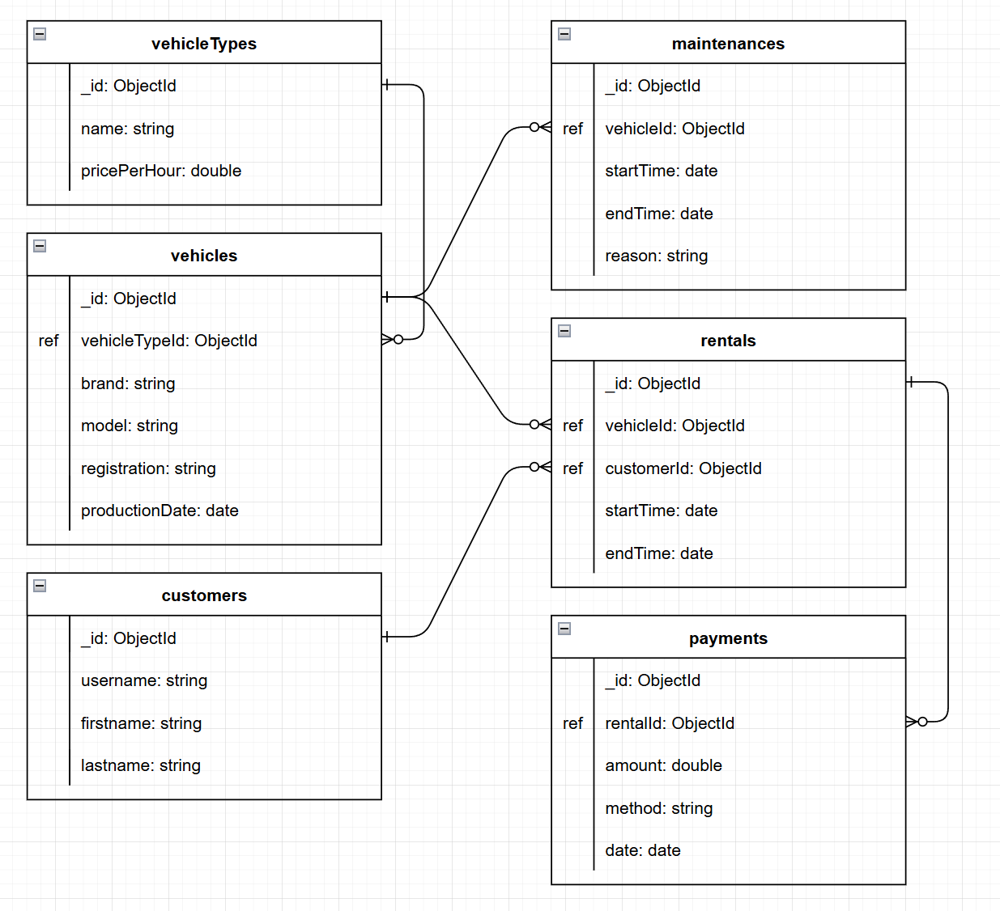

# Dokumentowe bazy danych – MongoDB

Ćwiczenie/zadanie


---

**Imiona i nazwiska autorów:** Szymon Żuk

--- 

Odtwórz z backupu bazę north0

```
mongorestore --nsInclude='north0.*' ./dump/
```

```
use north0
```


# Zadanie 1 - operacje wyszukiwania danych,  przetwarzanie dokumentów

# a)

stwórz kolekcję  `OrdersInfo`  zawierającą następujące dane o zamówieniach
- pojedynczy dokument opisuje jedno zamówienie

```js
[  
  {  
    "_id": ...
    
    OrderID": ... numer zamówienia
    
    "Customer": {  ... podstawowe informacje o kliencie skladającym  
      "CustomerID": ... identyfikator klienta
      "CompanyName": ... nazwa klienta
      "City": ... miasto 
      "Country": ... kraj 
    },  
    
    "Employee": {  ... podstawowe informacje o pracowniku obsługującym zamówienie
      "EmployeeID": ... idntyfikator pracownika 
      "FirstName": ... imie   
      "LastName": ... nazwisko
      "Title": ... stanowisko  
     
    },  
    
    "Dates": {
       "OrderDate": ... data złożenia zamówienia
       "RequiredDate": data wymaganej realizacji
    }

    "Orderdetails": [  ... pozycje/szczegóły zamówienia - tablica takich pozycji 
      {  
        "UnitPrice": ... cena
        "Quantity": ... liczba sprzedanych jednostek towaru
        "Discount": ... zniżka  
        "Value": ... wartośc pozycji zamówienia
        "product": { ... podstawowe informacje o produkcie 
          "ProductID": ... identyfikator produktu  
          "ProductName": ... nazwa produktu 
          "QuantityPerUnit": ... opis/opakowannie
          "CategoryID": ... identyfikator kategorii do której należy produkt
          "CategoryName" ... nazwę tej kategorii
        },  
      },  
      ...   
    ],  

    "Freight": ... opłata za przesyłkę
    "OrderTotal"  ... sumaryczna wartosc sprzedanych produktów

    "Shipment" : {  ... informacja o wysyłce
        "Shipper": { ... podstawowe inf o przewoźniku 
           "ShipperID":  
            "CompanyName":
        }  
        ... inf o odbiorcy przesyłki
        "ShipName": ...
        "ShipAddress": ...
        "ShipCity": ... 
        "ShipCountry": ...
    } 
  } 
]  
```


# b)

stwórz kolekcję  `CustomerInfo`  zawierającą następujące dane kazdym klencie
- pojedynczy dokument opisuje jednego klienta

```js
[  
  {  
    "_id": ...
    
    "CustomerID": ... identyfikator klienta
    "CompanyName": ... nazwa klienta
    "City": ... miasto 
    "Country": ... kraj 

	"Orders": [ ... tablica zamówień klienta o strukturze takiej jak w punkcie a) (oczywiście bez informacji o kliencie)
	  
	]

		  
]  
```

# c) 

Napisz polecenie/zapytanie: Dla każdego klienta pokaż wartość zakupionych przez niego produktów z kategorii 'Confections'  w 1997r
- Spróbuj napisać to zapytanie wykorzystując
	- oryginalne kolekcje (`customers, orders, orderdertails, products, categories`)
	- kolekcję `OrderInfo`
	- kolekcję `CustomerInfo`

- porównaj zapytania/polecenia/wyniki

```js
[  
  {  
    "_id": 
    
    "CustomerID": ... identyfikator klienta
    "CompanyName": ... nazwa klienta
	"ConfectionsSale97": ... wartość zakupionych przez niego produktów z kategorii 'Confections'  w 1997r

  }		  
]  
```

# d)

Napisz polecenie/zapytanie:  Dla każdego klienta poaje wartość sprzedaży z podziałem na lata i miesiące
Spróbuj napisać to zapytanie wykorzystując
	- oryginalne kolekcje (`customers, orders, orderdertails, products, categories`)
	- kolekcję `OrderInfo`
	- kolekcję `CustomerInfo`

- porównaj zapytania/polecenia/wyniki

```js
[  
  {  
    "_id": 
    
    "CustomerID": ... identyfikator klienta
    "CompanyName": ... nazwa klienta

	"Sale": [ ... tablica zawierająca inf o sprzedazy
	    {
            "Year":  ....
            "Month": ....
            "Total": ...	    
	    }
	    ...
	]
  }		  
]  
```

# e)

Załóżmy że pojawia się nowe zamówienie dla klienta 'ALFKI',  zawierające dwa produkty 'Chai' oraz "Ikura"
- pozostałe pola w zamówieniu (ceny, liczby sztuk prod, inf o przewoźniku itp. możesz uzupełnić wg własnego uznania)
Napisz polecenie które dodaje takie zamówienie do bazy
- aktualizując oryginalne kolekcje `orders`, `orderdetails`
- aktualizując kolekcję `OrderInfo`
- aktualizując kolekcję `CustomerInfo`

Napisz polecenie 
- aktualizując oryginalną kolekcję orderdetails`
- aktualizując kolekcję `OrderInfo`
- aktualizując kolekcję `CustomerInfo`

# f)

Napisz polecenie które modyfikuje zamówienie dodane w pkt e)  zwiększając zniżkę  o 5% (dla każdej pozycji tego zamówienia) 

Napisz polecenie 
- aktualizując oryginalną kolekcję `orderdetails`
- aktualizując kolekcję `OrderInfo`
- aktualizując kolekcję `CustomerInfo`


UWAGA:
W raporcie należy zamieścić kod poleceń oraz uzyskany rezultat, np wynik  polecenia `db.kolekcka.fimd().limit(2)` lub jego fragment


## Zadanie 1  - rozwiązanie

> Wyniki: 
> 
> przykłady, kod, zrzuty ekranów, komentarz ...

a)

Do stworzenia kolekcji użyłem tabeli pomocniczej orderdetails_tmp, którą później usunąłem

orderdetails_tmp:
```js
db.orderdetails.aggregate(
{
    $lookup: {
        from: "products",
        localField: "ProductID",
        foreignField: "ProductID",
        as: "product"
    }

},
{
    $unwind: "$product"
},
{
    $project: {
        ProductID: 0,
        "product.SupplierID": 0,
        "product.UnitPrice": 0,
        "product.UnitsInStock": 0,
        "product.ReorderLevel": 0,
        "product.Discontinued": 0,
        "product.UnitsOnOrder": 0,
        "product._id": 0
    }
},
{
    $lookup: {
        from: "categories",
        localField: "product.CategoryID",
        foreignField: "CategoryID",
        as: "category"
    }
},
{
    $unwind: "$category"
},
{
    $addFields: {
        "product.CategoryName": "$category.CategoryName"
    }
},
{
    $project: {
        category: 0
    }
},
{
    $sort: {
        "product.ProductID": 1
    }
},
{
    $out: "orderdetails_tmp"
}
)
```

OrderInfo:
```js
db.orders.aggregate(
// Customer
{
    $lookup: {
        from: "customers",
        localField: "CustomerID",
        foreignField: "CustomerID",
        as: "Customer"
    }

},
{
    $unwind: "$Customer"
},
{
    $project: {
        "Customer._id": 0,
        "Customer.ContactName": 0,
        "Customer.ContactTitle": 0,
        "Customer.Address": 0,
        "Customer.PostalCode": 0,
        "Customer.Region": 0,
        "Customer.Phone": 0,
        "Customer.Fax": 0
    }
},


// Employee
{
    $lookup: {
        from: "employees",
            localField: "EmployeeID",
            foreignField: "EmployeeID",
            as: "Employee"
    }
},
{
    $unwind: "$Employee"
},
{
    $project: {
        "Employee._id": 0,
        "Employee.TitleOfCourtesy": 0,
        "Employee.BirthDate": 0,
        "Employee.HireDate": 0,
        "Employee.Address": 0,
        "Employee.PostalCode": 0,
        "Employee.City": 0,
        "Employee.Region": 0,
        "Employee.Country": 0,
        "Employee.HomePhone": 0,
        "Employee.Extension": 0,
        "Employee.Photo": 0,
        "Employee.Notes": 0,
        "Employee.ReportsTo": 0,
        "Employee.PhotoPath": 0
    }
},


// Dates
{
    $addFields: {
        Dates: {
            OrderDate: "$OrderDate",
            RequiredDate: "$RequiredDate"
        }
    },
},

// Orderdetails
{
    $lookup: {
        from: "orderdetails_tmp",
        localField: "OrderID",
        foreignField: "OrderID",
        as: "Orderdetails"
    }
},
{
    $project: {
        "Orderdetails._id": 0,
        "Orderdetails.OrderID": 0,
        "Orderdetails.ProductID": 0,
    }
},
{
    $addFields: {
        Orderdetails: {
            $map: {
                input: "$Orderdetails",
                as: "od",
                in: {
                    UnitPrice: "$$od.UnitPrice",
                    Quantity: "$$od.Quantity",
                    Discount: "$$od.Discount",
                    Value: {
                        $multiply: [
                            "$$od.UnitPrice",
                            "$$od.Quantity",
                            { $subtract: [1, "$$od.Discount"] }
                        ]
                    },
                    product: "$$od.product"
                }
            }
        }
    }
},


// OrderTotal
{
    $addFields: {
        OrderTotal: { $sum: "$Orderdetails.Value" }
    }
},


// Shipment
{
    $lookup: {
        from: "shippers",
        localField: "ShipVia",
        foreignField: "ShipperID",
        as: "Shipper"
    }
},
{
    $unwind: "$Shipper"
},
{
    $addFields: {
        Shipment: {
            Shipper: {
                ShipperID: "$Shipper.ShipperID",
                CompanyName: "$Shipper.CompanyName"
            },
            ShipName: "$ShipName",
            ShipAddress: "$ShipAddress",
            ShipCity: "$ShipCity",
            ShipCountry: "$ShipCountry"
        },
        Dates: {
            OrderDate: "$OrderDate",
            RequiredDate: "$RequiredDate"
        }
    },
},
{
    $project: {
        Shipper: 0
    }
},


{
    $project: {
        CustomerID: 0,
        EmployeeID: 0,
        ShipVia: 0,
        OrderDate: 0,
        RequiredDate: 0,
        ShipAddress: 0,
        ShipCity: 0,
        ShipCountry: 0,
        ShipName: 0,
        ShipPostalCode: 0,
        ShipRegion: 0,
        ShippedDate: 0
    }
},
{
    $sort: {
        OrderID: 1
    }
},
{
    $out: "OrderInfo"
}
)
```


Wynik polecenia `db.OrderInfo.find().limit(2)`:
```js
[
  {
    "_id": {"$oid": "63a060b9bb3b972d6f4e1fc6"},
    "Customer": {
      "CustomerID": "VINET",
      "CompanyName": "Vins et alcools Chevalier",
      "City": "Reims",
      "Country": "France"
    },
    "Dates": {
      "OrderDate": {"$date": "1996-07-04T00:00:00.000Z"},
      "RequiredDate": {"$date": "1996-08-01T00:00:00.000Z"}
    },
    "Employee": {
      "EmployeeID": 5,
      "LastName": "Buchanan",
      "FirstName": "Steven",
      "Title": "Sales Manager"
    },
    "Freight": 32.38,
    "OrderID": 10248,
    "OrderTotal": 440,
    "Orderdetails": [
      {
        "UnitPrice": 14,
        "Quantity": 12,
        "Discount": 0,
        "Value": 168,
        "product": {
          "ProductID": 11,
          "ProductName": "Queso Cabrales",
          "CategoryID": 4,
          "QuantityPerUnit": "1 kg pkg.",
          "CategoryName": "Dairy Products"
        }
      },
      {
        "UnitPrice": 9.8,
        "Quantity": 10,
        "Discount": 0,
        "Value": 98,
        "product": {
          "ProductID": 42,
          "ProductName": "Singaporean Hokkien Fried Mee",
          "CategoryID": 5,
          "QuantityPerUnit": "32 - 1 kg pkgs.",
          "CategoryName": "Grains/Cereals"
        }
      },
      {
        "UnitPrice": 34.8,
        "Quantity": 5,
        "Discount": 0,
        "Value": 174,
        "product": {
          "ProductID": 72,
          "ProductName": "Mozzarella di Giovanni",
          "CategoryID": 4,
          "QuantityPerUnit": "24 - 200 g pkgs.",
          "CategoryName": "Dairy Products"
        }
      }
    ],
    "Shipment": {
      "Shipper": {
        "ShipperID": 3,
        "CompanyName": "Federal Shipping"
      },
      "ShipName": "Vins et alcools Chevalier",
      "ShipAddress": "59 rue de l'Abbaye",
      "ShipCity": "Reims",
      "ShipCountry": "France"
    }
  },
  {
    "_id": {"$oid": "63a060b9bb3b972d6f4e1fc7"},
    "Customer": {
      "CustomerID": "TOMSP",
      "CompanyName": "Toms Spezialitäten",
      "City": "Münster",
      "Country": "Germany"
    },
    "Dates": {
      "OrderDate": {"$date": "1996-07-05T00:00:00.000Z"},
      "RequiredDate": {"$date": "1996-08-16T00:00:00.000Z"}
    },
    "Employee": {
      "EmployeeID": 6,
      "LastName": "Suyama",
      "FirstName": "Michael",
      "Title": "Sales Representative"
    },
    "Freight": 11.61,
    "OrderID": 10249,
    "OrderTotal": 1863.4,
    "Orderdetails": [
      {
        "UnitPrice": 18.6,
        "Quantity": 9,
        "Discount": 0,
        "Value": 167.4,
        "product": {
          "ProductID": 14,
          "ProductName": "Tofu",
          "CategoryID": 7,
          "QuantityPerUnit": "40 - 100 g pkgs.",
          "CategoryName": "Produce"
        }
      },
      {
        "UnitPrice": 42.4,
        "Quantity": 40,
        "Discount": 0,
        "Value": 1696,
        "product": {
          "ProductID": 51,
          "ProductName": "Manjimup Dried Apples",
          "CategoryID": 7,
          "QuantityPerUnit": "50 - 300 g pkgs.",
          "CategoryName": "Produce"
        }
      }
    ],
    "Shipment": {
      "Shipper": {
        "ShipperID": 1,
        "CompanyName": "Speedy Express"
      },
      "ShipName": "Toms Spezialitäten",
      "ShipAddress": "Luisenstr. 48",
      "ShipCity": "Münster",
      "ShipCountry": "Germany"
    }
  }
]
```

b)

CustomerInfo:
```js
db.customers.aggregate([
{
    $lookup: {
        from: "OrderInfo",
        localField: "CustomerID",
        foreignField: "Customer.CustomerID",
        as: "Orders"
    }
},
{
    $project: {
        CustomerID: 1,
        CompanyName: 1,
        City: 1,
        Country: 1,
        Orders: 1
    }
},
{
    $project: {
        "Orders.Customer": 0
    }
},
{
    $sort: {
        CustomerID: 1
    }
},
{
    $out: "CustomerInfo"
}
])
```

Wynik polecenia `db.CustomerInfo.find().limit(2)`, ale usunąłem zamówienia oprócz pierwszego bo wynik był bardzo długi
```js
[
  {
    "_id": {"$oid": "63a05cdfbb3b972d6f4e097b"},
    "City": "Berlin",
    "CompanyName": "Alfreds Futterkiste",
    "Country": "Germany",
    "CustomerID": "ALFKI",
    "Orders": [
      {
        "_id": {"$oid": "63a060b9bb3b972d6f4e2151"},
        "OrderID": 10643,
        "Freight": 29.46,
        "Employee": {
          "EmployeeID": 6,
          "LastName": "Suyama",
          "FirstName": "Michael",
          "Title": "Sales Representative"
        },
        "Dates": {
          "OrderDate": {"$date": "1997-08-25T00:00:00.000Z"},
          "RequiredDate": {"$date": "1997-09-22T00:00:00.000Z"}
        },
        "Orderdetails": [
          {
            "UnitPrice": 45.6,
            "Quantity": 15,
            "Discount": 0.25,
            "Value": 513,
            "product": {
              "ProductID": 28,
              "ProductName": "Rössle Sauerkraut",
              "CategoryID": 7,
              "QuantityPerUnit": "25 - 825 g cans",
              "CategoryName": "Produce"
            }
          },
          {
            "UnitPrice": 18,
            "Quantity": 21,
            "Discount": 0.25,
            "Value": 283.5,
            "product": {
              "ProductID": 39,
              "ProductName": "Chartreuse verte",
              "CategoryID": 1,
              "QuantityPerUnit": "750 cc per bottle",
              "CategoryName": "Beverages"
            }
          },
          {
            "UnitPrice": 12,
            "Quantity": 2,
            "Discount": 0.25,
            "Value": 18,
            "product": {
              "ProductID": 46,
              "ProductName": "Spegesild",
              "CategoryID": 8,
              "QuantityPerUnit": "4 - 450 g glasses",
              "CategoryName": "Seafood"
            }
          }
        ],
        "OrderTotal": 814.5,
        "Shipment": {
          "Shipper": {
            "ShipperID": 1,
            "CompanyName": "Speedy Express"
          },
          "ShipName": "Alfreds Futterkiste",
          "ShipAddress": "Obere Str. 57",
          "ShipCity": "Berlin",
          "ShipCountry": "Germany"
        }
      },
      ... więcej zamówień ...
    ]
  },
  {
    "_id": {"$oid": "63a05cdfbb3b972d6f4e097c"},
    "City": "México D.F.",
    "CompanyName": "Ana Trujillo Emparedados y helados",
    "Country": "Mexico",
    "CustomerID": "ANATR",
    "Orders": [
      {
        "_id": {"$oid": "63a060b9bb3b972d6f4e2002"},
        "OrderID": 10308,
        "Freight": 1.61,
        "Employee": {
          "EmployeeID": 7,
          "LastName": "King",
          "FirstName": "Robert",
          "Title": "Sales Representative"
        },
        "Dates": {
          "OrderDate": {"$date": "1996-09-18T00:00:00.000Z"},
          "RequiredDate": {"$date": "1996-10-16T00:00:00.000Z"}
        },
        "Orderdetails": [
          {
            "UnitPrice": 28.8,
            "Quantity": 1,
            "Discount": 0,
            "Value": 28.8,
            "product": {
              "ProductID": 69,
              "ProductName": "Gudbrandsdalsost",
              "CategoryID": 4,
              "QuantityPerUnit": "10 kg pkg.",
              "CategoryName": "Dairy Products"
            }
          },
          {
            "UnitPrice": 12,
            "Quantity": 5,
            "Discount": 0,
            "Value": 60,
            "product": {
              "ProductID": 70,
              "ProductName": "Outback Lager",
              "CategoryID": 1,
              "QuantityPerUnit": "24 - 355 ml bottles",
              "CategoryName": "Beverages"
            }
          }
        ],
        "OrderTotal": 88.8,
        "Shipment": {
          "Shipper": {
            "ShipperID": 3,
            "CompanyName": "Federal Shipping"
          },
          "ShipName": "Ana Trujillo Emparedados y helados",
          "ShipAddress": "Avda. de la Constitución 2222",
          "ShipCity": "México D.F.",
          "ShipCountry": "Mexico"
        }
      },
      ... więcej zamówień ...
    ]
  }
]
```

c)

Oryginalne kolekcje:
```js
db.orders.aggregate([
{
    $match: {
        $expr: {
            $eq: [
                { $year: "$OrderDate" },
                1997
            ]
        }
    }
},


{
    $lookup: {
        from: "orderdetails",
        localField: "OrderID",
        foreignField: "OrderID",
        as: "Orderdetails"
    }
},
{
    $unwind: "$Orderdetails"
},


{
    $lookup: {
        from: "products",
        localField: "Orderdetails.ProductID",
        foreignField: "ProductID",
        as: "Product"
    }
},
{
    $unwind: "$Product"
},


{
    $lookup: {
        from: "categories",
        localField: "Product.CategoryID",
        foreignField: "CategoryID",
        as: "Category"
    }
},
{
    $unwind: "$Category"
},
{
    $match: {
        "Category.CategoryName": "Confections"
    }
},


{
    $lookup: {
        from: "customers",
        localField: "CustomerID",
        foreignField: "CustomerID",
        as: "Customer"
    }
},
{
    $unwind: "$Customer"
},


{
    $addFields: {
        Value: {
            $multiply: [
                "$Orderdetails.UnitPrice",
                "$Orderdetails.Quantity",
                { $subtract: [1, "$Orderdetails.Discount"] }
            ]
        },
    }
},

{
    $group: {
        _id: "$CustomerID",
        CompanyName: { $first: "$Customer.CompanyName" },
        ConfectionsSale97: { $sum: "$Value" }
    }
},
{
    $project: {
        _id: 1,
        CompanyName: 1,
        ConfectionsSale97: 1
    }
},
{
    $sort: {
        ConfectionsSale97: -1
    }
}
])
```

OrderInfo:
```js 
db.OrderInfo.aggregate([
{
    $match: {
        $expr: {
            $eq: [
                { $year: "$Dates.OrderDate" },
                1997
            ]
        }
    }
},


{
    $unwind: "$Orderdetails"
},
{
    $match: {
        "Orderdetails.product.CategoryName": "Confections"
    }
},


{
    $group: {
        _id: "$Customer.CustomerID",
        CompanyName: { $first: "$Customer.CompanyName" },
        ConfectionsSale97: { $sum: "$Orderdetails.Value" }
    }
},
{
    $project: {
        _id: 1,
        CompanyName: 1,
        ConfectionsSale97: 1
    }
},
{
    $sort: {
        ConfectionsSale97: -1
    }
}
])
```

CustomerInfo:
```js 
db.CustomerInfo.aggregate([
{
    $unwind: "$Orders"
},
{
    $match: {
        $expr: {
            $eq: [
                { $year: "$Orders.Dates.OrderDate" },
                1997
            ]
      }
    }
},


{
    $unwind: "$Orders.Orderdetails"
},
{
    $match: {
        "Orders.Orderdetails.product.CategoryName": "Confections"
    }
},


{
    $group: {
        _id: "$CustomerID",
        CompanyName: { $first: "$CompanyName" },
        ConfectionsSale97: { $sum: "$Orders.Orderdetails.Value" }
    }
},
{
    $project: {
        _id: 1,
        CompanyName: 1,
        ConfectionsSale97: 1
    }
},
{
    $sort: {
        ConfectionsSale97: -1
    }
}
])
```

Wynik zapytania jest taki sam dla wszystkich zapytań (tutaj wkleiłem pierwsze 5 z 20 pozycji):
```js 
[
  {
    "_id": "QUICK",
    "CompanyName": "QUICK-Stop",
    "ConfectionsSale97": 11648.599999657274
  },
  {
    "_id": "ERNSH",
    "CompanyName": "Ernst Handel",
    "ConfectionsSale97": 9829.757463981212
  },
  {
    "_id": "SAVEA",
    "CompanyName": "Save-a-lot Markets",
    "ConfectionsSale97": 6351.084993118047
  },
  {
    "_id": "OLDWO",
    "CompanyName": "Old World Delicatessen",
    "ConfectionsSale97": 2758.375
  },
  {
    "_id": "RATTC",
    "CompanyName": "Rattlesnake Canyon Grocery",
    "ConfectionsSale97": 2562.5
  },
  ... jeszcze 15 pozycji ...
]
```

To zapytanie jest stosunkowo proste na kolekcjach `OrderInfo` i `CustomerInfo`, ale skomplikowane na oryginalnych kolekcjach 
ze względu na konieczność używania `$lookup` i brak redundantnego pola `Value`.


d)

Oryginalne kolekcje:
```js 
db.orders.aggregate([
{
    $addFields: {
        Year: { $year: "$OrderDate" },
        Month: { $month: "$OrderDate" }
    }
},


{
    $lookup: {
        from: "orderdetails",
        localField: "OrderID",
        foreignField: "OrderID",
        as: "Orderdetails"
    }
},
{
    $unwind: "$Orderdetails"
},


{
    $lookup: {
        from: "customers",
        localField: "CustomerID",
        foreignField: "CustomerID",
        as: "Customer"
    }
},
{
    $unwind: "$Customer"
},


{
    $addFields: {
        Value: {
            $multiply: [
                "$Orderdetails.UnitPrice",
                "$Orderdetails.Quantity",
                { $subtract: [1, "$Orderdetails.Discount"] }
            ]
        },
    }
},

{
    $group: {
        _id: {
            CustomerID: "$CustomerID",
            Year: "$Year",
            Month: "$Month"
        },
        CustomerID: { $first: "$CustomerID" },
        CompanyName: { $first: "$Customer.CompanyName" },
        Year: { $first: "$Year" },
        Month: { $first: "$Month" },
        Total: { $sum: "$Value" }
    }
},
{
    $sort: {
        Year: 1,
        Month: 1
    }
},
{
    $group: {
        _id: "$CustomerID",
        CustomerID: { $first: "$CustomerID" },
        CompanyName: { $first: "$CompanyName" },
        Sales: {
            $push: {
                Year: "$Year",
                Month: "$Month",
                Total: "$Total"
            }
        }
    }
},
{
    $project: {
        _id: 0,
        CustomerID: 1,
        CompanyName: 1,
        Sales: 1
    }
},
{
    $sort: {
        CustomerID: 1
    }
}
])
```

OrderInfo:
```js 
db.OrderInfo.aggregate([
{
    $addFields: {
        Year: { $year: "$Dates.OrderDate" },
        Month: { $month: "$Dates.OrderDate" }
    }
},

{
    $group: {
        _id: {
            CustomerID: "$Customer.CustomerID",
            Year: "$Year",
            Month: "$Month"
        },
        CustomerID: { $first: "$Customer.CustomerID" },
        CompanyName: { $first: "$Customer.CompanyName" },
        Year: { $first: "$Year" },
        Month: { $first: "$Month" },
        Total: { $sum: "$OrderTotal" }
    }
},
{
    $sort: {
        Year: 1,
        Month: 1
    }
},
{
    $group: {
        _id: "$CustomerID",
        CustomerID: { $first: "$CustomerID" },
        CompanyName: { $first: "$CompanyName" },
        Sales: {
            $push: {
                Year: "$Year",
                Month: "$Month",
                Total: "$Total"
            }
        }
    }
},
{
    $project: {
        _id: 0,
        CustomerID: 1,
        CompanyName: 1,
        Sales: 1
    }
},
{
    $sort: {
        CustomerID: 1
    }
}
])
```

CustomerInfo:
```js
db.CustomerInfo.aggregate([
{
    $unwind: "$Orders"
},
{
    $addFields: {
        Year: { $year: "$Orders.Dates.OrderDate" },
        Month: { $month: "$Orders.Dates.OrderDate" }
    }
},

{
    $group: {
        _id: {
            CustomerID: "$CustomerID",
            Year: "$Year",
            Month: "$Month"
        },
        CustomerID: { $first: "$CustomerID" },
        CompanyName: { $first: "$CompanyName" },
        Year: { $first: "$Year" },
        Month: { $first: "$Month" },
        Total: { $sum: "$Orders.OrderTotal" }
    }
},
{
    $sort: {
        Year: 1,
        Month: 1
    }
},
{
    $group: {
        _id: "$CustomerID",
        CustomerID: { $first: "$CustomerID" },
        CompanyName: { $first: "$CompanyName" },
        Sales: {
            $push: {
                Year: "$Year",
                Month: "$Month",
                Total: "$Total"
            }
        }
    }
},
{
    $project: {
        _id: 0,
        CustomerID: 1,
        CompanyName: 1,
        Sales: 1
    }
},
{
    $sort: {
        CustomerID: 1
    }
}
]) 
```

Wynik jest taki sam dla wszystkich zapytań (tutaj pierwsze 3 z 24 pozycji):
```js 
[
  {
    "CompanyName": "Alfreds Futterkiste",
    "CustomerID": "ALFKI",
    "Sales": [
      {
        "Year": 1997,
        "Month": 8,
        "Total": 814.5
      },
      {
        "Year": 1997,
        "Month": 10,
        "Total": 1208
      },
      {
        "Year": 1998,
        "Month": 1,
        "Total": 845.799999922514
      },
      {
        "Year": 1998,
        "Month": 3,
        "Total": 471.19999970197676
      },
      {
        "Year": 1998,
        "Month": 4,
        "Total": 933.4999996051192
      }
    ]
  },
  {
    "CompanyName": "Ana Trujillo Emparedados y helados",
    "CustomerID": "ANATR",
    "Sales": [
      {
        "Year": 1996,
        "Month": 9,
        "Total": 88.8
      },
      {
        "Year": 1997,
        "Month": 8,
        "Total": 479.75
      },
      {
        "Year": 1997,
        "Month": 11,
        "Total": 320
      },
      {
        "Year": 1998,
        "Month": 3,
        "Total": 514.4
      }
    ]
  },
  ... jeszcze 21 pozycji ...
]
```


Podobnie jak w poprzednim zadanie zapytanie jest stosunkowo proste na kolekcjach `OrderInfo` i `CustomerInfo`, ale skomplikowane
na oryginalnych kolekcjach ze względu na konieczność używanie `$lookup` i brak redundantnych pól `Value` i `OrderTotal`.


e)


Oryginalne kolekcje: 
```js 
db.orders.insertOne(
{
    CustomerID: "ALFKI",
    EmployeeID: 5,
    Freight: 32.38,
    OrderDate: ISODate("2025-04-06T01:11:18.965Z"),
    OrderID: 20000,
    RequiredDate: ISODate("2025-04-15T01:11:18.965Z"),
    ShippedDate: ISODate("2025-04-11T01:11:18.965Z"),
    ShipAddress: "59 rue de l'Abbaye",
    ShipCity: "Reims",
    ShipCountry: "France",
    ShipName: "Vins et alcools Chevalier",
    ShipPostalCode: "51100",
    ShipRegion: "SP",
    ShipVia: 3
}
)

db.orderdetails.insertMany([
{
    Discount: 0.15,
    OrderID: 20000,
    ProductID: 1,
    Quantity: 2,
    UnitPrice: 18
},
{
    Discount: 0.05,
    OrderID: 20000,
    ProductID: 10,
    Quantity: 3,
    UnitPrice: 31
}
])
```

Wynik zapytania `db.orders.findOne({ OrderID: 20000 })`:

```js
[
  {
    "_id": {"$oid": "6819bbe2f24d19124b86849d"},
    "CustomerID": "ALFKI",
    "EmployeeID": 5,
    "Freight": 32.38,
    "OrderDate": {"$date": "2025-04-06T01:11:18.965Z"},
    "OrderID": 20000,
    "RequiredDate": {"$date": "2025-04-15T01:11:18.965Z"},
    "ShipAddress": "59 rue de l'Abbaye",
    "ShipCity": "Reims",
    "ShipCountry": "France",
    "ShipName": "Vins et alcools Chevalier",
    "ShipPostalCode": "51100",
    "ShipRegion": "SP",
    "ShipVia": 3,
    "ShippedDate": {"$date": "2025-04-11T01:11:18.965Z"}
  }
]
```

Wynik zapytania `db.orderdetails.find({ OrderID: 20000 })`:
```js
[
  {
    "_id": {"$oid": "6819bc2ff24d19124b86849f"},
    "Discount": 0.15,
    "OrderID": 20000,
    "ProductID": 1,
    "Quantity": 2,
    "UnitPrice": 18
  },
  {
    "_id": {"$oid": "6819bc2ff24d19124b8684a0"},
    "Discount": 0.05,
    "OrderID": 20000,
    "ProductID": 10,
    "Quantity": 3,
    "UnitPrice": 31
  }
]
```


OrderInfo:
```js 
db.OrderInfo.insertOne(
{
    Customer: {
        CustomerID: "ALFKI",
        CompanyName: "Alfreds Futterkiste",
        City: "Berlin",
        Country: "Germany"
    },
    Dates: {
        OrderDate: ISODate("2025-04-06T01:11:18.965Z"),
        RequiredDate: ISODate("2025-04-15T01:11:18.965Z")
    },
    Employee: {
        EmployeeID: 5,
        FirstName: "Steven",
        LastName: "Buchanan",
        Title: "Sales Manager"
    },
    Freight: 32.38,
    OrderID: 20000,
    OrderTotal: 18 * 2 * (1 - 0.15) + 31 * 3 * (1 - 0.05),
    Orderdetails: [
        {
            Discount: 0.15,
            Quantity: 2,
            UnitPrice: 18,
            Value: 18 * 2 * (1 - 0.15),
            product: {
                CategoryID: 1,
                CategoryName: "Beverages",
                ProductName: "Chai",
                ProductID: 1,
                QuantityPerUnit: "10 boxes x 20 bags"
            }
        },
        {
            Discount: 0.05,
            Quantity: 3,
            UnitPrice: 31,
            Value: 31 * 3 * (1 - 0.05),
            product: {
                CategoryID: 8,
                CategoryName: "Seafood",
                ProductName: "Ikura",
                ProductID: 10,
                QuantityPerUnit: "12 - 200 ml jars"
            }
        }
    ],
    Shipment: {
        ShipAddress: "59 rue de l'Abbaye",
        ShipCity: "Reims",
        ShipCountry: "France",
        ShipName: "Vins et alcools Chevalier",
        Shipper: {
            ShipperID: 3,
            CompanyName: "Federal Shipping"
        }
    }
}
)
```

Wynik zapytania `db.OrderInfo.findOne({ OrderID: 20000 })`:
```js
[
  {
    "_id": {"$oid": "6819bc68f24d19124b8684a2"},
    "Customer": {
      "CustomerID": "ALFKI",
      "CompanyName": "Alfreds Futterkiste",
      "City": "Berlin",
      "Country": "Germany"
    },
    "Dates": {
      "OrderDate": {"$date": "2025-04-06T01:11:18.965Z"},
      "RequiredDate": {"$date": "2025-04-15T01:11:18.965Z"}
    },
    "Employee": {
      "EmployeeID": 5,
      "FirstName": "Steven",
      "LastName": "Buchanan",
      "Title": "Sales Manager"
    },
    "Freight": 32.38,
    "OrderID": 20000,
    "OrderTotal": 118.94999999999999,
    "Orderdetails": [
      {
        "Discount": 0.15,
        "Quantity": 2,
        "UnitPrice": 18,
        "Value": 30.599999999999998,
        "product": {
          "CategoryID": 1,
          "CategoryName": "Beverages",
          "ProductName": "Chai",
          "ProductID": 1,
          "QuantityPerUnit": "10 boxes x 20 bags"
        }
      },
      {
        "Discount": 0.05,
        "Quantity": 3,
        "UnitPrice": 31,
        "Value": 88.35,
        "product": {
          "CategoryID": 8,
          "CategoryName": "Seafood",
          "ProductName": "Ikura",
          "ProductID": 10,
          "QuantityPerUnit": "12 - 200 ml jars"
        }
      }
    ],
    "Shipment": {
      "ShipAddress": "59 rue de l'Abbaye",
      "ShipCity": "Reims",
      "ShipCountry": "France",
      "ShipName": "Vins et alcools Chevalier",
      "Shipper": {
        "ShipperID": 3,
        "CompanyName": "Federal Shipping"
      }
    }
  }
]
```


CustomerInfo:
```js
db.CustomerInfo.updateOne(
{
    CustomerID: "ALFKI"
},
{
    $push: {
        Orders: {
            Dates: {
                OrderDate: ISODate("2025-04-06T01:11:18.965Z"),
                RequiredDate: ISODate("2025-04-15T01:11:18.965Z")
            },
            Employee: {
                EmployeeID: 5,
                FirstName: "Steven",
                LastName: "Buchanan",
                Title: "Sales Manager"
            },
            Freight: 32.38,
            OrderID: 20000,
            OrderTotal: 18 * 2 * (1 - 0.15) + 31 * 3 * (1 - 0.05),
            Orderdetails: [
                {
                    Discount: 0.15,
                    Quantity: 2,
                    UnitPrice: 18,
                    Value: 18 * 2 * (1 - 0.15),
                    product: {
                        CategoryID: 1,
                        CategoryName: "Beverages",
                        ProductName: "Chai",
                        ProductID: 1,
                        QuantityPerUnit: "10 boxes x 20 bags"
                    }
                },
                {
                    Discount: 0.05,
                    Quantity: 3,
                    UnitPrice: 31,
                    Value: 31 * 3 * (1 - 0.05),
                    product: {
                        CategoryID: 8,
                        CategoryName: "Seafood",
                        ProductName: "Ikura",
                        ProductID: 10,
                        QuantityPerUnit: "12 - 200 ml jars"
                    }
                }
            ],
            Shipment: {
                ShipAddress: "59 rue de l'Abbaye",
                ShipCity: "Reims",
                ShipCountry: "France",
                ShipName: "Vins et alcools Chevalier",
                Shipper: {
                    ShipperID: 3,
                    CompanyName: "Federal Shipping"
                }
            }
        }
    }
}
)
```

Fragment wyniku zapytania `db.CustomerInfo.findOne({ CustomerID: "ALFKI" })`:
```js 
[
  {
    "_id": {"$oid": "63a05cdfbb3b972d6f4e097b"},
    "City": "Berlin",
    "CompanyName": "Alfreds Futterkiste",
    "Country": "Germany",
    "CustomerID": "ALFKI",
    "Orders": [
      ... inne zamówienia ...
      {
        "Dates": {
          "OrderDate": {"$date": "2025-04-06T01:11:18.965Z"},
          "RequiredDate": {"$date": "2025-04-15T01:11:18.965Z"}
        },
        "Employee": {
          "EmployeeID": 5,
          "FirstName": "Steven",
          "LastName": "Buchanan",
          "Title": "Sales Manager"
        },
        "Freight": 32.38,
        "OrderID": 20000,
        "OrderTotal": 118.94999999999999,
        "Orderdetails": [
          {
            "Discount": 0.15,
            "Quantity": 2,
            "UnitPrice": 18,
            "Value": 30.599999999999998,
            "product": {
              "CategoryID": 1,
              "CategoryName": "Beverages",
              "ProductName": "Chai",
              "ProductID": 1,
              "QuantityPerUnit": "10 boxes x 20 bags"
            }
          },
          {
            "Discount": 0.05,
            "Quantity": 3,
            "UnitPrice": 31,
            "Value": 88.35,
            "product": {
              "CategoryID": 8,
              "CategoryName": "Seafood",
              "ProductName": "Ikura",
              "ProductID": 10,
              "QuantityPerUnit": "12 - 200 ml jars"
            }
          }
        ],
        "Shipment": {
          "ShipAddress": "59 rue de l'Abbaye",
          "ShipCity": "Reims",
          "ShipCountry": "France",
          "ShipName": "Vins et alcools Chevalier",
          "Shipper": {
            "ShipperID": 3,
            "CompanyName": "Federal Shipping"
          }
        }
      }
    ]
  }
]
```

W tym przypadku zapytania na oryginalnych kolekcjach są bardzo proste i krótkie, a zapytania na `OrderInfo` i `CustomerInfo` są skomplikowane.
W `OrderInfo` i `CustomerInfo` trzeba obliczać wartości redundantnych danych.

f)

oryginalne kolekcje: 
```js 
db.orderdetails.updateMany(
{
    OrderID: 20000
},
{
    $inc: {
        Discount: 0.05
    }
})
```

Wynik zapytania `db.orderdetails.find({OrderID: 20000})`:
```js 
[
  {
    "_id": {"$oid": "6819bc2ff24d19124b86849f"},
    "Discount": 0.2,
    "OrderID": 20000,
    "ProductID": 1,
    "Quantity": 2,
    "UnitPrice": 18
  },
  {
    "_id": {"$oid": "6819bc2ff24d19124b8684a0"},
    "Discount": 0.1,
    "OrderID": 20000,
    "ProductID": 10,
    "Quantity": 3,
    "UnitPrice": 31
  }
]
```

OrderInfo:
```js 
db.OrderInfo.updateOne(
{
    OrderID: 20000
},
[
{
    $set: {
        Orderdetails: {
            $map: {
                input: "$Orderdetails",
                as: "od",
                in: {
                    UnitPrice: "$$od.UnitPrice",
                    Quantity: "$$od.Quantity",
                    Discount: { $add: ["$$od.Discount", 0.05] },
                    Value: {
                        $multiply: [
                            "$$od.UnitPrice",
                            "$$od.Quantity",
                            { $subtract: [1, { $add: ["$$od.Discount", 0.05] }] }
                        ]
                    },
                    product: "$$od.product"
                }
            }
        }
    }
},
{
    $set: {
        OrderTotal: { $sum: "$Orderdetails.Value" }
    }
}
]
)
```

Wynik zapytania `db.OrderInfo.findOne({ OrderID: 20000 })`:
```js 
[
  {
    "_id": {"$oid": "6819bc68f24d19124b8684a2"},
    "Customer": {
      "CustomerID": "ALFKI",
      "CompanyName": "Alfreds Futterkiste",
      "City": "Berlin",
      "Country": "Germany"
    },
    "Dates": {
      "OrderDate": {"$date": "2025-04-06T01:11:18.965Z"},
      "RequiredDate": {"$date": "2025-04-15T01:11:18.965Z"}
    },
    "Employee": {
      "EmployeeID": 5,
      "FirstName": "Steven",
      "LastName": "Buchanan",
      "Title": "Sales Manager"
    },
    "Freight": 32.38,
    "OrderID": 20000,
    "OrderTotal": 112.5,
    "Orderdetails": [
      {
        "UnitPrice": 18,
        "Quantity": 2,
        "Discount": 0.2,
        "Value": 28.8,
        "product": {
          "CategoryID": 1,
          "CategoryName": "Beverages",
          "ProductName": "Chai",
          "ProductID": 1,
          "QuantityPerUnit": "10 boxes x 20 bags"
        }
      },
      {
        "UnitPrice": 31,
        "Quantity": 3,
        "Discount": 0.1,
        "Value": 83.7,
        "product": {
          "CategoryID": 8,
          "CategoryName": "Seafood",
          "ProductName": "Ikura",
          "ProductID": 10,
          "QuantityPerUnit": "12 - 200 ml jars"
        }
      }
    ],
    "Shipment": {
      "ShipAddress": "59 rue de l'Abbaye",
      "ShipCity": "Reims",
      "ShipCountry": "France",
      "ShipName": "Vins et alcools Chevalier",
      "Shipper": {
        "ShipperID": 3,
        "CompanyName": "Federal Shipping"
      }
    }
  }
]
```

CustomerInfo:
```js 
db.CustomerInfo.updateOne(
{
    CustomerID: "ALFKI"
},
[
{
    $set: {
        Orders: {
            $map: {
                input: "$Orders",
                as: "order",
                in: {
                    Customer: "$$order.Customer",
                    Dates: "$$order.Dates",
                    Employee: "$$order.Employee",
                    Freight: "$$order.Freight",
                    OrderID: "$$order.OrderID",
                    Shipment: "$$order.Shipment",
                    OrderTotal: "$$order.OrderTotal",
                    Orderdetails: {
                        $cond: {
                             if: { $eq: ["$$order.OrderID", 20000] },
                             then: {
                                $map: {
                                    input: "$$order.Orderdetails",
                                    as: "od",
                                    in: {
                                        UnitPrice: "$$od.UnitPrice",
                                        Quantity: "$$od.Quantity",
                                        Discount: { $add: ["$$od.Discount", 0.05] },
                                        Value: {
                                            $multiply: [
                                                "$$od.UnitPrice",
                                                "$$od.Quantity",
                                                { $subtract: [1, { $add: ["$$od.Discount", 0.05] }] }
                                            ]
                                        },
                                        product: "$$od.product"
                                    }
                                }
                             },
                             else: "$$order.Orderdetails"
                        }
                    }
                }
            }
        }
    }
},
{
    $set: {
        Orders: {
            $map: {
                input: "$Orders",
                as: "order",
                in: {
                    Customer: "$$order.Customer",
                    Dates: "$$order.Dates",
                    Employee: "$$order.Employee",
                    Freight: "$$order.Freight",
                    OrderID: "$$order.OrderID",
                    Shipment: "$$order.Shipment",
                    Orderdetails: "$$order.Orderdetails",
                    OrderTotal: { $sum: "$$order.Orderdetails.Value" }
                }
            }
        }
    }
}
]
)
```

Fragment wyniku zapytania `db.CustomerInfo.find({ CustomerID: "ALFKI" })`:
```js 
[
  {
    "_id": {"$oid": "63a05cdfbb3b972d6f4e097b"},
    "City": "Berlin",
    "CompanyName": "Alfreds Futterkiste",
    "Country": "Germany",
    "CustomerID": "ALFKI",
    "Orders": [
   	  ... inne zamówienia ...
      {
        "Dates": {
          "OrderDate": {"$date": "2025-04-06T01:11:18.965Z"},
          "RequiredDate": {"$date": "2025-04-15T01:11:18.965Z"}
        },
        "Employee": {
          "EmployeeID": 5,
          "FirstName": "Steven",
          "LastName": "Buchanan",
          "Title": "Sales Manager"
        },
        "Freight": 32.38,
        "OrderID": 20000,
        "Shipment": {
          "ShipAddress": "59 rue de l'Abbaye",
          "ShipCity": "Reims",
          "ShipCountry": "France",
          "ShipName": "Vins et alcools Chevalier",
          "Shipper": {
            "ShipperID": 3,
            "CompanyName": "Federal Shipping"
          }
        },
        "Orderdetails": [
          {
            "UnitPrice": 18,
            "Quantity": 2,
            "Discount": 0.2,
            "Value": 28.8,
            "product": {
              "CategoryID": 1,
              "CategoryName": "Beverages",
              "ProductName": "Chai",
              "ProductID": 1,
              "QuantityPerUnit": "10 boxes x 20 bags"
            }
          },
          {
            "UnitPrice": 31,
            "Quantity": 3,
            "Discount": 0.1,
            "Value": 83.7,
            "product": {
              "CategoryID": 8,
              "CategoryName": "Seafood",
              "ProductName": "Ikura",
              "ProductID": 10,
              "QuantityPerUnit": "12 - 200 ml jars"
            }
          }
        ],
        "OrderTotal": 112.5
      }
    ]
  }
]
```

Zapytanie na oryginalnych kolekcjach jest trywialne, a na kolekcjach `OrderInfo` i `CustomerInfo` skomplikowane.
Jest to spowodowane przede wszystkim przez konieczność aktualizowania redundantnych danych.
`CustomerInfo` jest szczególnie problematyczne, bo trzeba użyć dwóch zagnieżdżonych $map. 

....

# Zadanie 2 - modelowanie danych


Zaproponuj strukturę bazy danych dla wybranego/przykładowego zagadnienia/problemu

Należy wybrać jedno zagadnienie/problem (A lub B lub C)

Przykład A
- Wykładowcy, przedmioty, studenci, oceny
	- Wykładowcy prowadzą zajęcia z poszczególnych przedmiotów
	- Studenci uczęszczają na zajęcia
	- Wykładowcy wystawiają oceny studentom
	- Studenci oceniają zajęcia

Przykład B
- Firmy, wycieczki, osoby
	- Firmy organizują wycieczki
	- Osoby rezerwują miejsca/wykupują bilety
	- Osoby oceniają wycieczki

Przykład C
- Własny przykład o podobnym stopniu złożoności

a) Zaproponuj  różne warianty struktury bazy danych i dokumentów w poszczególnych kolekcjach oraz przeprowadzić dyskusję każdego wariantu (wskazać wady i zalety każdego z wariantów)
- zdefiniuj schemat/reguły walidacji danych
- wykorzystaj referencje
- dokumenty zagnieżdżone
- tablice

b) Kolekcje należy wypełnić przykładowymi danymi

c) W kontekście zaprezentowania wad/zalet należy zaprezentować kilka przykładów/zapytań/operacji oraz dla których dedykowany jest dany wariant

W sprawozdaniu należy zamieścić przykładowe dokumenty w formacie JSON ( pkt a) i b)), oraz kod zapytań/operacji (pkt c)), wraz z odpowiednim komentarzem opisującym strukturę dokumentów oraz polecenia ilustrujące wykonanie przykładowych operacji na danych

Do sprawozdania należy kompletny zrzut wykonanych/przygotowanych baz danych (taki zrzut można wykonać np. za pomocą poleceń `mongoexport`, `mongdump` …) oraz plik z kodem operacji/zapytań w wersji źródłowej (np. plik .js, np. plik .md ), załącznik powinien mieć format zip

## Zadanie 2  - rozwiązanie

Robię projekt w grupie 3-osobowej, więc tę część laboratorium zrobiłem razem z osobami z mojej grupy (Mateusz Ziajka i Krzysztof Pieczka).
Tematem naszego projektu jest wypożyczalnia samochodów. Zaprojektowaliśmy wstępnie i skonsultowaliśmy na zajęciach
strukturę kolekcji bazującą na referencjach, która po poprawkach wygląda tak:

Głównym problemem walidacji jest dostępność samochodu. Samochody mogą być wypożyczane (kolekcja `rentals`) i naprawiane (kolekcja `maintenances`).
Obie te kolekcje przechowują zarówno przeszłe, jak i zaplanowane w przyszłości wypożyczenia/naprawy.

### Wariant 1 - referencje
W tym wariancie schemat kolekcji bazuje na referencjach i jest taki sam jak na zamieszczonym wcześniej zdjęciu.


1. Skrypt generujący przykładowe dane:
```js 
db.dropDatabase();

const sedanTypeId = ObjectId("000000000000000000000001");
const suvTypeId = ObjectId("000000000000000000000002");
db.vehicleTypes.insertMany([
    { _id: sedanTypeId, name: "Sedan", pricePerHour: 25.0 },
    { _id: suvTypeId, name: "SUV", pricePerHour: 35.0 },
]);

const vehicle1Id = ObjectId("000000000000000000000011");
const vehicle2Id = ObjectId("000000000000000000000012");
const vehicle3Id = ObjectId("000000000000000000000013");
db.vehicles.insertMany([
    { 
      _id: vehicle1Id, vehicleTypeId: sedanTypeId, brand: "Toyota", 
    model: "Camry", registration: "KR12345", productionDate: new Date("2023-01-15T00:00:00Z") 
    },
    { 
      _id: vehicle2Id, vehicleTypeId: suvTypeId, brand: "Honda", 
      model: "CR-V", registration: "KR67890", productionDate: new Date("2022-05-20T00:00:00Z") 
    },
    { 
      _id: vehicle3Id, vehicleTypeId: sedanTypeId, brand: "Toyota", 
      model: "Corolla", registration: "KR11223", productionDate: new Date("2024-03-10T00:00:00Z") 
    }
]);

const customer1Id = ObjectId("000000000000000000000021");
const customer2Id = ObjectId("000000000000000000000022");
db.customers.insertMany([
    { 
      _id: customer1Id, username: "jankowalski", 
    firstname: "Jan", lastname: "Kowalski" 
    },
    { 
      _id: customer2Id, username: "annanowak", 
      firstname: "Anna", lastname: "Nowak" 
    }
]);

const rental1Id = ObjectId("000000000000000000000031");
const rental2Id = ObjectId("000000000000000000000032");
const rental3Id = ObjectId("000000000000000000000033");
const rental4Id = ObjectId("000000000000000000000034");
const rental5Id = ObjectId("000000000000000000000035");
db.rentals.insertMany([
    { 
      _id: rental1Id, vehicleId: vehicle1Id, customerId: customer1Id, 
    startTime: new Date("2025-05-07T10:00:00Z"), hours: 24, totalPaidAmount: 24 * 25 
    },
    { 
      _id: rental2Id, vehicleId: vehicle2Id, customerId: customer2Id, 
      startTime: new Date("2025-05-08T14:00:00Z"), hours: 48, totalPaidAmount: 48 * 35 
    },
    { 
      _id: rental3Id, vehicleId: vehicle3Id, customerId: customer2Id, 
      startTime: new Date("2025-05-09T09:00:00Z"), hours: 12, totalPaidAmount: 12 * 25 
    },
    { 
      _id: rental4Id, vehicleId: vehicle3Id, customerId: customer1Id, 
      startTime: new Date("2025-05-11T09:00:00Z"), hours: 12, totalPaidAmount: 12 * 25 
    },
    { 
      _id: rental5Id, vehicleId: vehicle3Id, customerId: customer2Id, 
      startTime: new Date("2025-05-13T09:00:00Z"), hours: 24, totalPaidAmount: 24 * 25
    }
]);

db.maintenances.insertMany([
    { 
      _id: ObjectId("000000000000000000000041"), vehicleId: vehicle1Id, 
      startTime: new Date("2025-05-05T09:00:00Z"), endTime: new Date("2025-05-05T12:00:00Z"), 
      reason: "Wymiana oleju" 
    },
    { 
      _id: ObjectId("000000000000000000000042"), vehicleId: vehicle1Id, 
      startTime: new Date("2025-05-28T09:00:00Z"), endTime: new Date("2025-05-30T12:00:00Z"), 
      reason: "Przegląd" 
    },
    { 
      _id: ObjectId("000000000000000000000043"), vehicleId: vehicle2Id, 
      startTime: new Date("2025-05-10T15:00:00Z"), endTime: new Date("2025-05-10T16:00:00Z"), 
      reason: "Wymiana opon" 
    }
]);

db.payments.insertMany([
    { 
      _id: ObjectId("000000000000000000000051"), rentalId: rental1Id, amount: 300, 
      method: "Karta kredytowa", date: new Date("2025-05-07T12:00:00Z") 
    },
    {
      _id: ObjectId("000000000000000000000052"), rentalId: rental1Id, amount: 300, 
      method: "Karta kredytowa", date: new Date("2025-05-08T12:00:00Z") 
    },
    { 
      _id: ObjectId("000000000000000000000053"), rentalId: rental2Id, amount: 1200, 
      method: "Przelew bankowy", date: new Date("2025-05-08T16:00:00Z") 
    },
    { 
      _id: ObjectId("000000000000000000000054"), rentalId: rental3Id, amount: 240, 
      method: "Gotówka", date: new Date("2025-05-09T10:00:00Z") 
    }
]);
```

2. Zapytanie dodające nowy samochód z kategorii `SUV`:
```js 
db.vehicles.insertOne({
    _id: ObjectId("000000000000000000000014"),
    vehicleTypeId: suvTypeId,
    brand: "BMW",
    model: "X5",
    registration: "KR12363",
    productionDate: new Date("2023-01-19T00:00:00Z")
});
```

3. Zapytanie modyfikujące cenę dla samochodów z kategorii `SUV`:
```js 
db.vehicleTypes.updateOne({
    vehicleTypeId: suvTypeId,
},
{
    $set: {
        pricePerHour: 40.0
    }
});
```

4. Zapytanie zwracające okresy, w których dane auto jest niedostępne:
```js 
db.vehicles.aggregate([
  { $match: { _id: ObjectId("000000000000000000000011") } },
  {
    $lookup: {
      from: "rentals",
      localField: "_id",
      foreignField: "vehicleId",
      as: "rentals"
    }
  },
  {
    $addFields: {
      rentals: {
        $map: {
          input: "$rentals",
          as: "r",
          in: {
            startTime: "$$r.startTime",
            endTime: {
              $dateAdd: {
                startDate: "$$r.startTime",
                unit: "hour",
                amount: "$$r.hours"
              }
            }
          }
        }
      }
    }
  },
  {
    $lookup: {
      from: "maintenances",
      localField: "_id",
      foreignField: "vehicleId",
      as: "maintenances"
    }
  },
  {
    $addFields: {
      maintenances: {
        $map: {
          input: "$maintenances",
          as: "m",
          in: {
            startTime: "$$m.startTime",
            endTime: "$$m.endTime"
          }
        }
      }
    }
  },
  {
    $project: {
      _id: 0,
      unavailablePeriods: {
        $sortArray: {
          input: { $concatArrays: ["$rentals", "$maintenances"] },
          sortBy: { startTime: 1 }
        }
      }
    }
  }
]);
```

Wynik: 

```js 
[
  {
    "unavailablePeriods": [
      {
        "startTime": {"$date": "2025-05-05T09:00:00.000Z"},
        "endTime": {"$date": "2025-05-05T12:00:00.000Z"}
      },
      {
        "startTime": {"$date": "2025-05-07T10:00:00.000Z"},
        "endTime": {"$date": "2025-05-08T10:00:00.000Z"}
      },
      {
        "startTime": {"$date": "2025-05-28T09:00:00.000Z"},
        "endTime": {"$date": "2025-05-30T12:00:00.000Z"}
      }
    ]
  }
]
```

5. Zapytanie usuwające jeddo wypożyczenie auta - rekord z tabeli rentals
```js
db.rentals.deleteOne({ _id: ObjectId("000000000000000000000011") });
```

6. Zapytanie "raport" zwracające dla kazdego klienta listę jego wypożyczeń, całkowity czas oraz zsumowaną liczbę pieniędzy.
```js
db.customers.aggregate([
  {
    $lookup: {
      from: "rentals",
      localField: "_id",
      foreignField: "customerId",
      as: "rentals"
    }
  },
  {
    $unwind: {
      path: "$rentals",
      preserveNullAndEmptyArrays: true
    }
  },
  {
    $lookup: {
      from: "vehicles",
      localField: "rentals.vehicleId",
      foreignField: "_id",
      as: "vehicle"
    }
  },
  {
    $unwind: {
      path: "$vehicle",
      preserveNullAndEmptyArrays: true
    }
  },
  {
    $lookup: {
      from: "payments",
      localField: "rentals._id",
      foreignField: "rentalId",
      as: "payments"
    }
  },
  {
    $addFields: {
      totalRentalPayment: { $sum: "$payments.amount" }
    }
  },
  {
    $group: {
      _id: "$_id",
      username: { $first: "$username" },
      firstname: { $first: "$firstname" },
      lastname: { $first: "$lastname" },
      rentals: {
        $push: {
          rentalId: "$rentals._id",
          vehicle: {
            brand: "$vehicle.brand",
            model: "$vehicle.model"
          },
          startTime: "$rentals.startTime",
          hours: "$rentals.hours",
          totalPaid: "$totalRentalPayment"
        }
      },
      totalHours: { $sum: "$rentals.hours" },
      totalPayments: { $sum: "$totalRentalPayment" },
      avgRentalDuration: { $avg: "$rentals.hours" }
    }
  },
  {
    $project: {
      _id: 0,
      customer: {
        username: "$username",
        firstname: "$firstname",
        lastname: "$lastname"
      },
      totalHours: 1,
      totalPayments: 1,
      avgRentalDuration: 1,
      rentals: 1
    }
  }
]);
```


Wynik:
```js 
[
  {
    "avgRentalDuration": 18,
    "customer": {
      "username": "jankowalski",
      "firstname": "Jan",
      "lastname": "Kowalski"
    },
    "rentals": [
      {
        "rentalId": {"$oid": "000000000000000000000031"},
        "vehicle": {
          "brand": "Toyota",
          "model": "Camry"
        },
        "startTime": {"$date": "2025-05-07T10:00:00.000Z"},
        "hours": 24,
        "totalPaid": 600
      },
      {
        "rentalId": {"$oid": "000000000000000000000034"},
        "vehicle": {
          "brand": "Toyota",
          "model": "Corolla"
        },
        "startTime": {"$date": "2025-05-11T09:00:00.000Z"},
        "hours": 12,
        "totalPaid": 0
      }
    ],
    "totalHours": 36,
    "totalPayments": 600
  },
  {
    "avgRentalDuration": 28,
    "customer": {
      "username": "annanowak",
      "firstname": "Anna",
      "lastname": "Nowak"
    },
    "rentals": [
      {
        "rentalId": {"$oid": "000000000000000000000032"},
        "vehicle": {
          "brand": "Honda",
          "model": "CR-V"
        },
        "startTime": {"$date": "2025-05-08T14:00:00.000Z"},
        "hours": 48,
        "totalPaid": 1200
      },
      {
        "rentalId": {"$oid": "000000000000000000000033"},
        "vehicle": {
          "brand": "Toyota",
          "model": "Corolla"
        },
        "startTime": {"$date": "2025-05-09T09:00:00.000Z"},
        "hours": 12,
        "totalPaid": 240
      },
      {
        "rentalId": {"$oid": "000000000000000000000035"},
        "vehicle": {
          "brand": "Toyota",
          "model": "Corolla"
        },
        "startTime": {"$date": "2025-05-13T09:00:00.000Z"},
        "hours": 24,
        "totalPaid": 0
      }
    ],
    "totalHours": 84,
    "totalPayments": 1440
  }
]
```

### Wariant 2 - rentalInfo
Jedna kolekcja rentalInfo

1. W celu stworzenia tej kolekcji wykorzystaliśmy uprzednio utworzone kolekcje:
```js 
db.rentals.aggregate([
{
    $lookup: {
        from: "vehicles",
        localField: "vehicleId",
        foreignField: "_id",
        as: "vehicle"
    }
},
{
    $unwind: "$vehicle"
},
{
    $lookup: {
        from: "vehicleTypes",
        localField: "vehicle.vehicleTypeId",
        foreignField: "_id",
        as: "vehicleType"
    }
},
{
    $unwind: "$vehicleType"
},
{
    $addFields: {
        "vehicle.vehicleType": "$vehicleType"
    }
},
{
    $lookup: {
        from: "customers",
        localField: "customerId",
        foreignField: "_id",
        as: "customer"
    }
},
{
    $unwind: "$customer"
},
{
    $lookup: {
        from: "payments",
        localField: "_id",
        foreignField: "rentalId",
        as: "payments"
    }
},
{
    $lookup: {
        from: "maintenances",
        localField: "vehicleId",
        foreignField: "vehicleId",
        as: "vehicle.maintenances"
    }
},
{
    $project: {
        customerId: 0,
        "customer._id": 0,
        "vehicle._id": 0,
        "vehicle.vehicleType._id": 0,
        "vehicle.vehicleTypeId": 0,
        vehicleId: 0,
        vehicleType: 0
    }
},
{
$addFields: {
    payments: {
        $map: {
            input: "$payments",
            as: "p",
            in: {
                amount: "$$p.amount",
                method: "$$p.method",
                date: "$$p.date"
            }
        }
    },
    "vehicle.maintenances": {
        $map: {
            input: "$vehicle.maintenances",
            as: "m",
            in: {
                startTime: "$$m.startTime",
                endTime: "$$m.endTime",
                reason: "$$m.reason"
            }
        }
    }
    }
},
{
    $out: "rentalInfo"
}
]);
```


2. Nie mamy kolekcji z samochodami, więc zamiast dodawania samochodu zrobiliśmy dodawanie wypożyczenia z nowym samochodem:
```js 
db.rentalInfo.insertOne({
    startTime: new Date("2025-01-19T00:00:00Z"),
    hours: 12,
    totalPaidAmount: 300 + 200,
    vehicle: {
        brand: "BMW",
        model: "X5",
        registration: "KR12363",
        productionDate: new Date("2023-01-19T00:00:00Z"),
        vehicleType: {
            name: "SUV",
            pricePerHour: 35
        },
        maintenances: []
    },
    customer: {
        username: "jankowalski",
        firstname: "Jan",
        lastname: "Kowalski"
    },
    payments: []
});
```

3. Zapytanie modyfikujące cenę dla samochodów z kategorii `SUV`:
```js 
db.rentalInfo.updateMany({
    "vehicle.vehicleType.name": "SUV"
},
{
    $set: {
        "vehicle.vehicleType.pricePerHour": 40.0
    }
});
```

4. Zapytanie zwracające okresy, w których dane auto jest niedostępne:
```js 
db.rentalInfo.aggregate([
{
    $match: {
        "vehicle.registration": "KR12363"
    }
},
{
    $addFields: {
        endTime: {
            $dateAdd: {
                startDate: "$startTime",
                unit: "hour",
                amount: "$hours"
            }
        }
    }
},
{
    $addFields: {
        maintenances: {
            $map: {
                input: "$vehicle.maintenances",
                as: "m",
                in: {
                    startTime: "$$m.startTime",
                    endTime: "$$m.endTime"
                }
            }
        }
    }
},
{
    $group: {
        _id: "$_id",
        maintenances: { $first: "$maintenances" },
        rentals: { $push: { startTime: "$startTime", endTime: "$endTime" } }
    }
},
{
    $project: {
        _id: 0,
        unavailablePeriods:
            {
               $sortArray: {
                    input: { $concatArrays: ["$rentals", "$maintenances"] },
                    sortBy: { startTime: 1 } }
            }
    }
}
]);
```

Wyniki:
```js 
[
  {
    "unavailablePeriods": [
      {
        "startTime": {"$date": "2025-01-19T00:00:00.000Z"},
        "endTime": {"$date": "2025-01-19T12:00:00.000Z"}
      }
    ]
  }
]
```

5. Zapytanie usuwające jedno wypożyczenie auta
```js
db.rentalInfo.deleteOne({ _id: ObjectId("000000000000000000000011") });
```

6. Zapytanie "raport" zwracające dla każdego klienta listę jego wypożyczeń, całkowity czas oraz zsumowaną liczbę pieniędzy.
```js
db.rentalInfo.aggregate([
  {
    $addFields: {
      totalRentalPayment: { $sum: "$payments.amount" }
    }
  },
  {
    $group: {
      _id: "$customer.username",
      username: { $first: "$customer.username" },
      firstname: { $first: "$customer.firstname" },
      lastname: { $first: "$customer.lastname" },
      rentals: {
        $push: {
          rentalId: "$_id",
          vehicle: {
            brand: "$vehicle.brand",
            model: "$vehicle.model"
          },
          startTime: "$startTime",
          hours: "hours",
          totalPaid: "$totalRentalPayment"
        }
      },
      totalHours: { $sum: "$hours" },
      totalPayments: { $sum: "$totalRentalPayment" },
      avgRentalDuration: { $avg: "$hours" }
    }
  },
  {
    $project: {
      _id: 0,
      customer: {
        username: "$username",
        firstname: "$firstname",
        lastname: "$lastname"
      },
      totalHours: 1,
      totalPayments: 1,
      avgRentalDuration: 1,
      rentals: 1
    }
  }
]);
```
Wyniki:
```js
[
  {
    "avgRentalDuration": 28,
    "customer": {
      "username": "annanowak",
      "firstname": "Anna",
      "lastname": "Nowak"
    },
    "rentals": [
      {
        "rentalId": {"$oid": "000000000000000000000032"},
        "vehicle": {
          "brand": "Honda",
          "model": "CR-V"
        },
        "startTime": {"$date": "2025-05-08T14:00:00.000Z"},
        "hours": "hours",
        "totalPaid": 1200
      },
      {
        "rentalId": {"$oid": "000000000000000000000033"},
        "vehicle": {
          "brand": "Toyota",
          "model": "Corolla"
        },
        "startTime": {"$date": "2025-05-09T09:00:00.000Z"},
        "hours": "hours",
        "totalPaid": 240
      },
      {
        "rentalId": {"$oid": "000000000000000000000035"},
        "vehicle": {
          "brand": "Toyota",
          "model": "Corolla"
        },
        "startTime": {"$date": "2025-05-13T09:00:00.000Z"},
        "hours": "hours",
        "totalPaid": 0
      }
    ],
    "totalHours": 84,
    "totalPayments": 1440
  },
  {
    "avgRentalDuration": 16,
    "customer": {
      "username": "jankowalski",
      "firstname": "Jan",
      "lastname": "Kowalski"
    },
    "rentals": [
      {
        "rentalId": {"$oid": "000000000000000000000031"},
        "vehicle": {
          "brand": "Toyota",
          "model": "Camry"
        },
        "startTime": {"$date": "2025-05-07T10:00:00.000Z"},
        "hours": "hours",
        "totalPaid": 600
      },
      {
        "rentalId": {"$oid": "000000000000000000000034"},
        "vehicle": {
          "brand": "Toyota",
          "model": "Corolla"
        },
        "startTime": {"$date": "2025-05-11T09:00:00.000Z"},
        "hours": "hours",
        "totalPaid": 0
      },
      {
        "rentalId": {"$oid": "681a74a560b6b4609630f984"},
        "vehicle": {
          "brand": "BMW",
          "model": "X5"
        },
        "startTime": {"$date": "2025-01-19T00:00:00.000Z"},
        "hours": "hours",
        "totalPaid": 0
      }
    ],
    "totalHours": 48,
    "totalPayments": 600
  }
] 
```

### Wariant 3
Dwie kolekcje 
 - vehicleInfo z zagnieżdżonymi vehicleType maintenances rentals payments 
 - customers

1. Do tego wariantu dane wygenerowaliśmy ręcznie
```js 
const customer1Id = ObjectId("000000000000000000000021");
const customer2Id = ObjectId("000000000000000000000022");
// Kolekcja vehicleInfo
db.vehicleInfo.insertMany([
  {
    brand: "Toyota",
    model: "Camry",
    registration: "KR12345",
    productionDate: new Date("2023-01-15T00:00:00Z"),

    vehicleType: {
      name: "Sedan",
      pricePerHour: 25.0
    },

    maintenances: [
      {
        startTime: new Date("2025-05-05T09:00:00Z"),
        endTime: new Date("2025-05-05T12:00:00Z"),
        reason: "Wymiana oleju"
      },
      {
        startTime: new Date("2025-05-28T09:00:00Z"),
        endTime: new Date("2025-05-30T12:00:00Z"),
        reason: "Przegląd"
      }
    ],

    rentals: [
      {
        customerId: customer1Id,
        startTime: new Date("2025-05-07T10:00:00Z"),
        hours: 24,
        totalPaidAmount: 600,
        payments: [
          {
            amount: 300,
            method: "Karta kredytowa",
            date: new Date("2025-05-07T12:00:00Z")
          },
          {
            amount: 300,
            method: "Karta kredytowa",
            date: new Date("2025-05-08T12:00:00Z")
          }
        ]
      }
    ]
  },

  {
    brand: "Honda",
    model: "CR-V",
    registration: "KR67890",
    productionDate: new Date("2022-05-20T00:00:00Z"),

    vehicleType: {
      name: "SUV",
      pricePerHour: 35.0
    },

    maintenances: [
      {
        startTime: new Date("2025-05-10T15:00:00Z"),
        endTime: new Date("2025-05-10T16:00:00Z"),
        reason: "Wymiana opon"
      }
    ],

    rentals: [
      {
      
        customerId: customer2Id,
        startTime: new Date("2025-05-08T14:00:00Z"),
        hours: 48,
        totalPaidAmount: 1680,
        payments: [
          {
            amount: 1680,
            method: "Przelew bankowy",
            date: new Date("2025-05-08T16:00:00Z")
          }
        ]
      }
    ]
  },

  {
    brand: "Toyota",
    model: "Corolla",
    registration: "KR11223",
    productionDate: new Date("2024-03-10T00:00:00Z"),

    vehicleType: {
      name: "Sedan",
      pricePerHour: 25.0
    },

    maintenances: [],

    rentals: [
      {
        customerId: customer2Id,
        startTime: new Date("2025-05-09T09:00:00Z"),
        hours: 12,
        totalPaidAmount: 300,
        payments: [
          {
            amount: 240,
            method: "Gotówka",
            date: new Date("2025-05-09T10:00:00Z")
          }
        ]
      },
      {
        customerId: customer1Id,
        startTime: new Date("2025-05-11T09:00:00Z"),
        hours: 12,
        totalPaidAmount: 300,
        payments: []
      },
      {
        customerId: customer2Id,
        startTime: new Date("2025-05-13T09:00:00Z"),
        hours: 24,
        totalPaidAmount: 600,
        payments: []
      }
    ]
  }
]);
```

2. Zapytanie dodające nowy samochód z kategorii `SUV`:
```js
 db.vehicleInfo.insertOne({
  brand: "BMW",
  model: "X5",
  registration: "KR12363",
  productionDate: new Date("2023-01-19T00:00:00Z"),

  vehicleType: {
    name: "SUV",
    pricePerHour: 40.0
  },
  rentals: [],
  maintenances: []
});
```

3. Zapytanie modyfikujące cenę dla samochodów SUV:
```js 
db.vehicleInfo.updateMany(
  { "vehicleType.name": "SUV" },
  {
    $set: {
      "vehicleType.pricePerHour": 45.0
    }
  }
);
```

4. Zapytanie zwracające okresy, w których dane auto jest niedostępne:
```js 
db.vehicleInfo.aggregate([
  {
    $match: {
      registration: "KR67890"  
    }
  },
  {
    $project: {
      unavailablePeriods: {
        $concatArrays: [
          {
            $map: {
              input: "$rentals",
              as: "rental",
              in: {
                startTime: "$$rental.startTime",
                endTime: {
                  $dateAdd: {
                    startDate: "$$rental.startTime",
                    unit: "hour",
                    amount: "$$rental.hours"
                  }
                }
              }
            }
          },
          {
            $map: {
              input: "$maintenances",
              as: "maintenance",
              in: {
                startTime: "$$maintenance.startTime",
                endTime: "$$maintenance.endTime"
              }
            }
          }
        ]
      }
    }
  },
  {
    $project: {
      unavailablePeriods: { $sortArray: { input: "$unavailablePeriods", sortBy: { startTime: 1 } } }
    }
  }
]);
```

Wynik:
```js 
[
  {
    "_id": {"$oid": "681a73d760b6b4609630f97c"},
    "unavailablePeriods": [
      {
        "startTime": {"$date": "2025-05-08T14:00:00.000Z"},
        "endTime": {"$date": "2025-05-10T14:00:00.000Z"}
      },
      {
        "startTime": {"$date": "2025-05-10T15:00:00.000Z"},
        "endTime": {"$date": "2025-05-10T16:00:00.000Z"}
      }
    ]
  }
]
```

5. Zapytanie usuwające jedno wypożyczenie auta (tutaj potrzebna jest rejestracja samochodu i np. data startu wypożyczenia)
```js
db.vehiclesInfo.updateOne({
    registration: "KR12345",
},
[
{
    $set: {
        rentals: {
            $filter: {
                 input: "$rentals",
                 as: "r",
                 cond: { $ne: ["$$r.startTime", new Date("2025-05-07T10:00:00Z")] }
            }
        }
    }
}
]);

```

6. Zapytanie "raport" zwracające dla każdego klienta listę jego wypożyczeń, całkowity czas oraz zsumowaną liczbę pieniędzy.
```js
db.vehiclesInfo.aggregate(
{
    $unwind: "$rentals"
},
{
    $lookup: {
        from: "customers",
        localField: "rentals.customerId",
        foreignField: "_id",
        as: "customer"
    }
},
{
    $unwind: "$customer"
},
{
$addFields: {
    totalRentalPayment: { $sum: "$rentals.payments.amount" }
}
},
{
    $group: {
        _id: "$customer.username",
        username: { $first: "$customer.username" },
        firstname: { $first: "$customer.firstname" },
        lastname: { $first: "$customer.lastname" },
        rentals: {
            $push: {
                rentalId: "$_id",
                vehicle: {
                    brand: "$brand",
                    model: "$model"
                },
                startTime: "$rentals.startTime",
                hours: "hours",
                totalPaid: "$totalRentalPayment"
            }
        },
        totalHours: { $sum: "$rentals.hours" },
        totalPayments: { $sum: "$totalRentalPayment" },
        avgRentalDuration: { $avg: "$rentals.hours" }
    }
}
)
```

Wyniki:
```js 
[
  {
    "_id": "annanowak",
    "avgRentalDuration": 28,
    "firstname": "Anna",
    "lastname": "Nowak",
    "rentals": [
      {
        "rentalId": {"$oid": "681a6a1b253c7e130cb35493"},
        "vehicle": {
          "brand": "Honda",
          "model": "CR-V"
        },
        "startTime": {"$date": "2025-05-08T14:00:00.000Z"},
        "hours": "hours",
        "totalPaid": 1680
      },
      {
        "rentalId": {"$oid": "681a6a1b253c7e130cb35494"},
        "vehicle": {
          "brand": "Toyota",
          "model": "Corolla"
        },
        "startTime": {"$date": "2025-05-09T09:00:00.000Z"},
        "hours": "hours",
        "totalPaid": 240
      },
      {
        "rentalId": {"$oid": "681a6a1b253c7e130cb35494"},
        "vehicle": {
          "brand": "Toyota",
          "model": "Corolla"
        },
        "startTime": {"$date": "2025-05-13T09:00:00.000Z"},
        "hours": "hours",
        "totalPaid": 0
      }
    ],
    "totalHours": 84,
    "totalPayments": 1920,
    "username": "annanowak"
  },
  {
    "_id": "jankowalski",
    "avgRentalDuration": 12,
    "firstname": "Jan",
    "lastname": "Kowalski",
    "rentals": [
      {
        "rentalId": {"$oid": "681a6a1b253c7e130cb35494"},
        "vehicle": {
          "brand": "Toyota",
          "model": "Corolla"
        },
        "startTime": {"$date": "2025-05-11T09:00:00.000Z"},
        "hours": "hours",
        "totalPaid": 0
      }
    ],
    "totalHours": 12,
    "totalPayments": 0,
    "username": "jankowalski"
  }
]
```

### Wnioski
- W wariancie 1 zapytania modyfikujące i dodające nowe dane są proste, ale zapytania raportujące są bardzo skomplikowane.
- W wariancie 2 zapytania raportujące są znacznie mniej skomplikowane, ale zapytania modifkujące bardziej skomplikowane. Jest też dużo powielonych dane o użytkowniku, samochodach i wypożyczeniach.
- W wariancie 3 zapytania raportujące są mniej skomplikowane niż w wariancie 1, a zapytania modyfikujące podobnie skomplikowane jak w wariancie 3, ale jest znacznie mniej redundancji danych.
Typowe zapytania, czyli wyświetlenie samochodów i sprawdzenie dostępności powinny być szybkie w tym wariancie.

Wariant 3 wydaje się najbardziej sensowny.

---

Punktacja:

|         |     |
| ------- | --- |
| zadanie | pkt |
| 1       | 1   |
| 2       | 1   |
| razem   | 2   |


