# Sprawozdanie z Entity Framework

## Szymon Żuk

## Część 1

1) Sprawdziłem wersję dotnet i utworzyłem projekt:
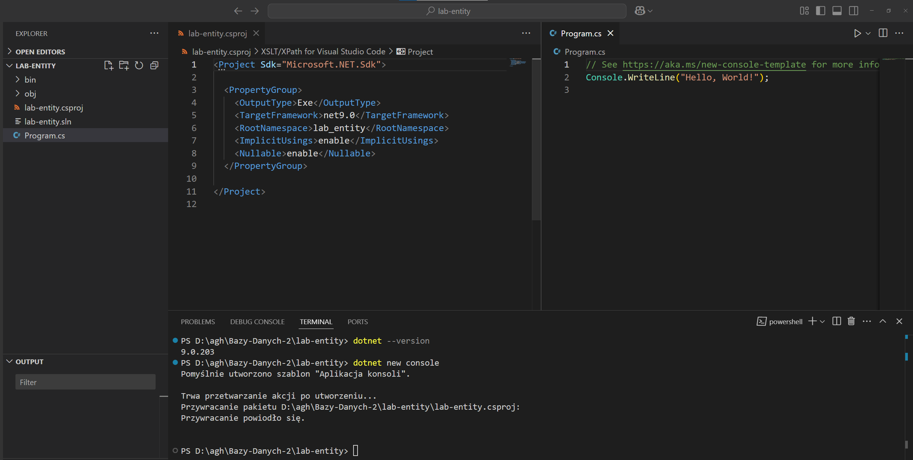

2) Zbudowałem i uruchomiłem aplikację:


3) Dodałem klasę Product
```cs
public class Product
{
    public int ProductID { get; set; }
    public string? ProductName { get; set; }
    public int UnitsInStock { get; set; }
}
```

4) Dodałem klasę ProdContext
```cs
public class ProdContext : DbContext { }
```

5) Dostałem błąd podczas budowania aplikacji
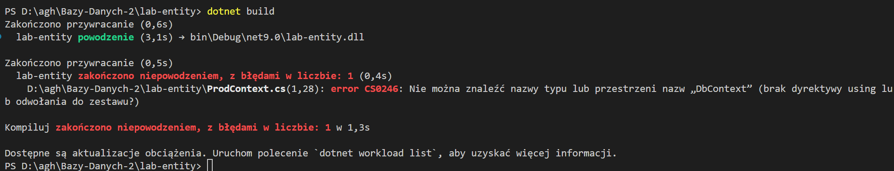

6) Dodałem using do ProdContext.cs
```cs
using Microsoft.EntityFrameworkCore;

public class ProdContext : DbContext { }
```

7) Dostałem inny błąd podczas budowania aplikacji:


8) Dodałem pakiet EntityFrameworkCore (używam najnowszej wersji dotneta więc nie musiałem podawać wersji pakietu)
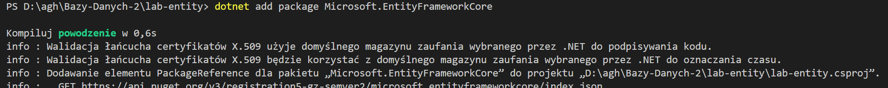

9) Pakiet pojawił się w pliku .csproj i folderze bin. Zbudowałem projekt tym razem bez błędów
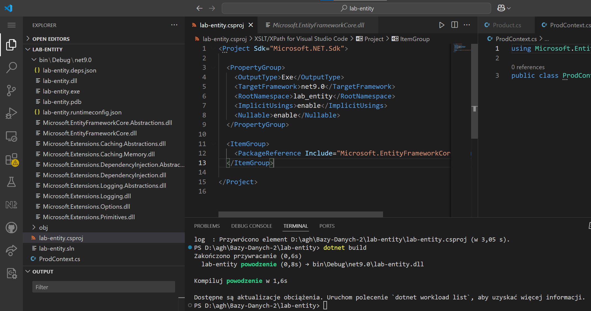

10) Dodałem DbSet produktów do ProdContext i spróbowałem utworzyć migrację, ale dostałem błąd
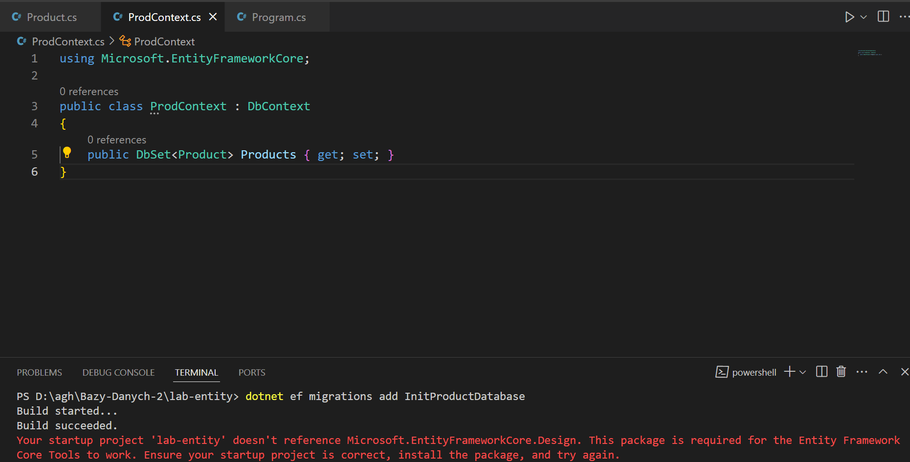

11) Dodałem pakiet EntityFrameworkCore.Design
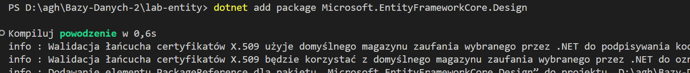 

12) Dostałem inny błąd przy tworzeniu migracji
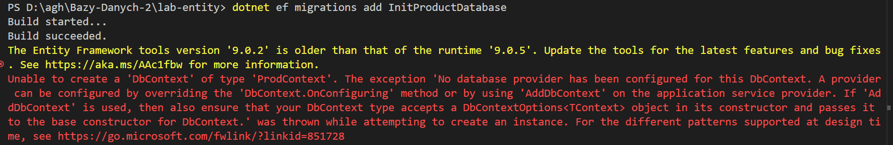

13) Dodałem przeładowanie metody onConfiguring z bazą danych Sqlite
```cs
using Microsoft.EntityFrameworkCore;

public class ProdContext : DbContext
{
    public DbSet<Product> Products { get; set; }

    protected override void OnConfiguring(DbContextOptionsBuilder optionsBuilder)
    {
        base.OnConfiguring(optionsBuilder);
        optionsBuilder.UseSqlite("Datasource=MyProductDatabase");
    }

}
```

14) Dostałem kolejny błąd przy budowaniu aplikacji
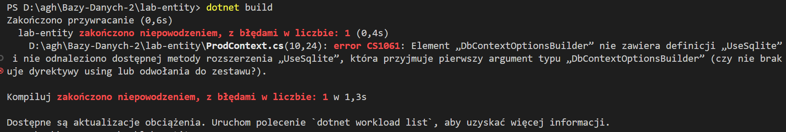

15) Dodałem pakiet EntityFrameworkCore.Sqlite
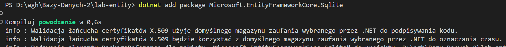

16) Dodałem migrację i zrobiłem update bazy danych
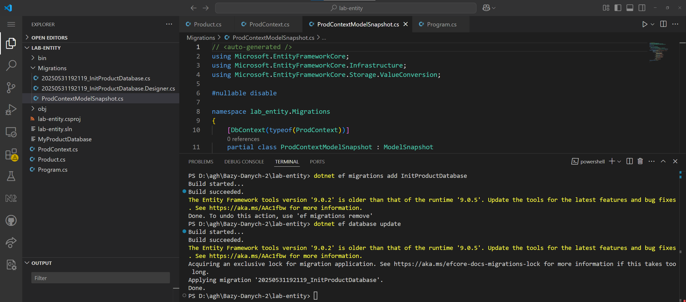

17) Sprawdziłem update za pomocą sqlite
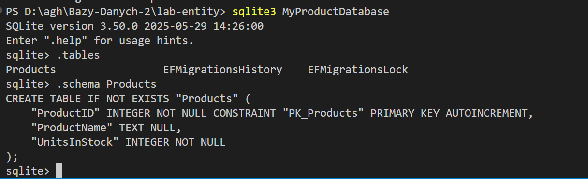

18) Dodałem kod tworzący produkt do Program.cs. Zbudowałem i uruchomiłem dwukrotnie aplikację jednocześnie sprawdzając zawartość bazy danych
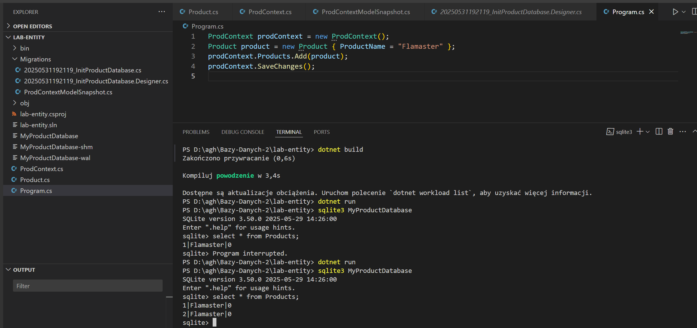

19) Dodałem wypisywanie produktów z tabeli 
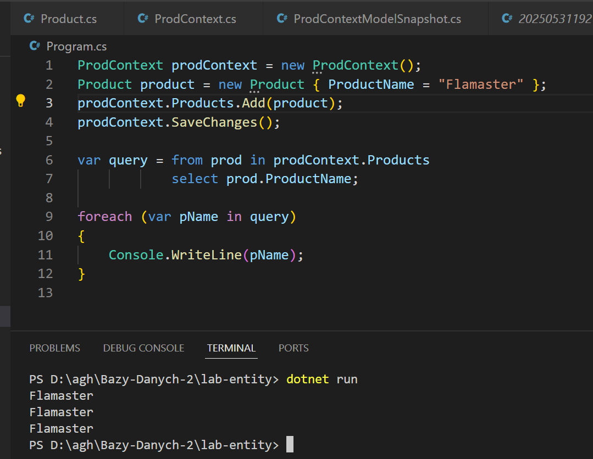

20) Dodałem zapytanie o nazwę produktu i produkty Kredki i Krzesło
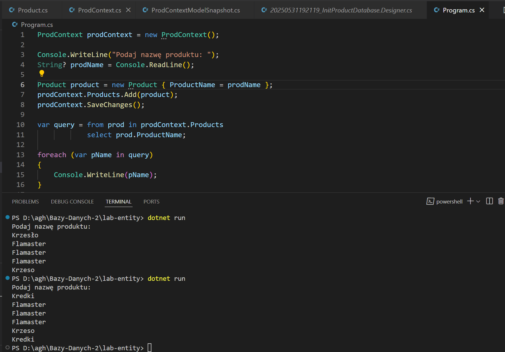

## Część 2

### Podpunkt a)

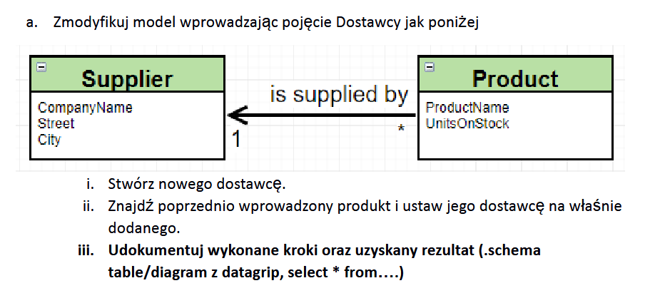

Modyfikacje modelu danych

```cs
// Dodałem klasę dostawcy
public class Supplier
{
    public int SupplierID { get; set; }
    public string? CompanyName { get; set; }
    public string? Street { get; set; }
    public string? City { get; set; }
}
```

```cs
public class ProdContext : DbContext
{
    public DbSet<Product> Products { get; set; }
    // Dodałem DbSet dostawców
    public DbSet<Supplier> Suppliers { get; set; }

    protected override void OnConfiguring(DbContextOptionsBuilder optionsBuilder)
    {
        base.OnConfiguring(optionsBuilder);
        optionsBuilder.UseSqlite("Datasource=MyProductDatabase");
    }
}
```

```cs
public class Product
{
    public int ProductID { get; set; }
    public string? ProductName { get; set; }
    public int UnitsInStock { get; set; }
    // Dodałem pole tworzące relację
    public Supplier? IsSuppliedBy { get; set; }
}
```

Wynik zapytania .schema po dodaniu migracji i aktualizacji bazy danych

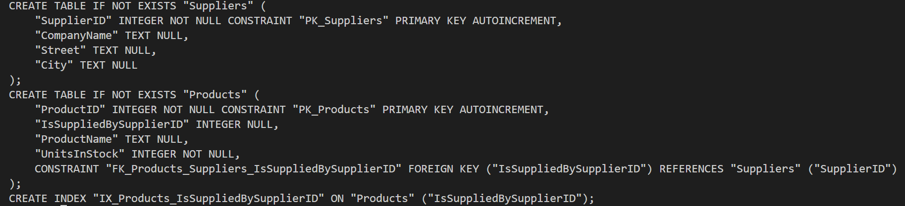

Kod dodający dostawcę, znajdujący wcześniej dodany produkt i ustawiający jego dostawcę na nowo dodanego

```cs
var prodContext = new ProdContext();
// Dodanie nowego dostawcy
var supplier = new Supplier
{
    CompanyName = "Inpost",
    Street = "Kawiory",
    City = "Kraków"
};
prodContext.Suppliers.Add(supplier);
// Znalezienie wcześniej dodanego produktu w bazie danych
var query = from prod in prodContext.Products
            where prod.ProductName == "Kredki"
            select prod;
var product = query.First();
// Ustawienie dostawcy
product.IsSuppliedBy = supplier;
prodContext.SaveChanges();
```

Po wykonaniu kodu zmiany są widoczne w bazie danych (produkt Kredki ma ustawioną wartość kolumny "1", czyli ID dostawcy)

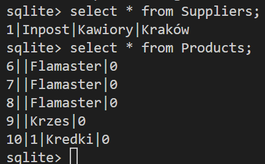

### Podpunkt b)

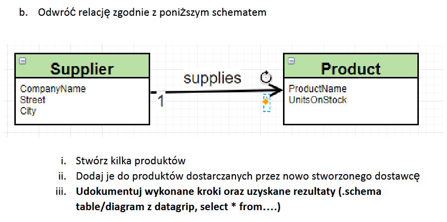

Modyfikacje modelu danych

```cs
public class Product
{
    public int ProductID { get; set; }
    public string? ProductName { get; set; }
    public int UnitsInStock { get; set; }
    // Usunąłem pole IsSuppliedBy
    // public Supplier? IsSuppliedBy { get; set; }
}
```

```cs
public class Supplier
{
    public int SupplierID { get; set; }
    public string? CompanyName { get; set; }
    public string? Street { get; set; }
    public string? City { get; set; }
    // Dodałem pole tworzące relację
    public ICollection<Product> Supplies { get; set; } = [];
}
```

Wynik zapytania .schema po dodaniu migracji i aktualizacji bazy danych

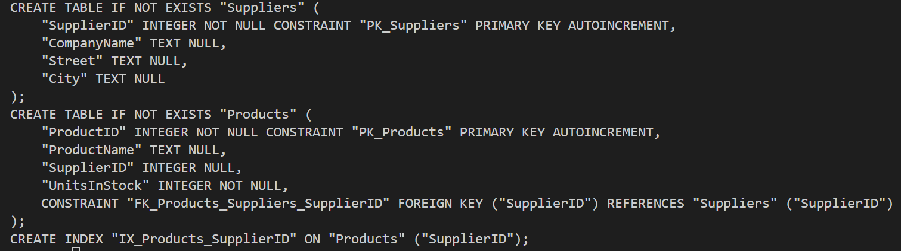

Kod dodajacy kilka produktów, znajdujący wcześniej dodanego dostawcę i dodający produkty jako dostarczane przez tego dostawcę

```cs
var prodContext = new ProdContext();
// Dodanie kilku produktów
List<Product> products = [
    new Product
    {
        ProductName = "Ołówek",
        UnitsInStock = 4000
    },
    new Product
    {
        ProductName = "Laptop",
        UnitsInStock = 4
    },
    new Product
    {
        ProductName = "Zeszyt",
        UnitsInStock = 17
    }];
foreach (var p in products)
{
    prodContext.Products.Add(p);
}

// Znalezienie wcześniej dodanego dostawcy
var query = from supp in prodContext.Suppliers
            where supp.CompanyName == "Inpost"
            select supp;
var supplier = query.First();

// Dodanie produktów jako dostarczanych przez tego dostawcę
foreach (var p in products)
{
    supplier.Supplies.Add(p);
}
prodContext.SaveChanges();
```

Po wykonaniu kodu zmiany są widoczne w bazie danych (nowe produkty mają ustawioną wartość kolumny "1", czyli ID dostawcy)

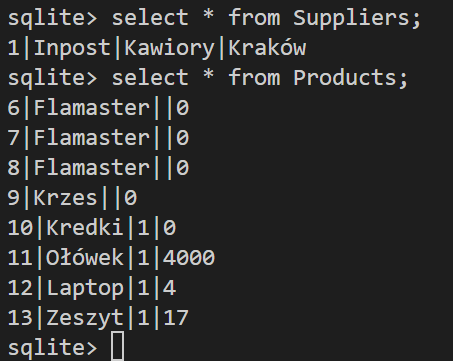

### Podpunkt c) 
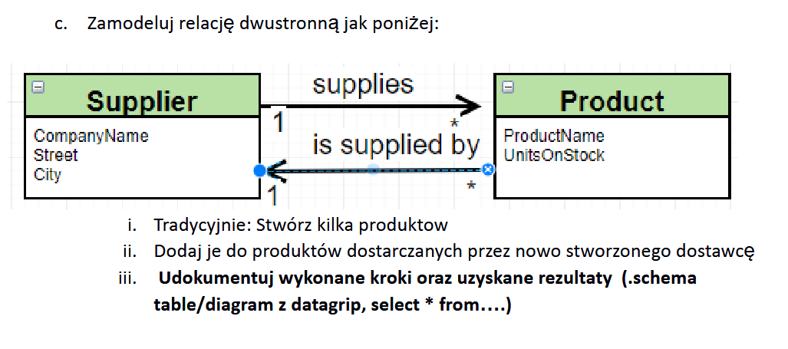

Modyfikacje modelu danych

```cs
public class Product
{
    public int ProductID { get; set; }
    public string? ProductName { get; set; }
    public int UnitsInStock { get; set; }
    // Dodałem wcześniej usunięte pole tworzące relację
    public Supplier? IsSuppliedBy { get; set; }
}
```

Wynik zapytania .schema po dodaniu migracji i aktualizacji bazy danych

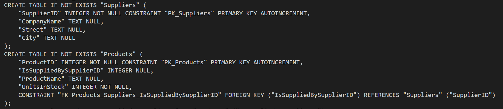

Kod dodajacy kilka produktów, znajdujący wcześniej dodanego dostawcę, dodający produkty jako dostarczane przez tego dostawcę i ustawiający dostawcę dla każdego produktu

```cs
var prodContext = new ProdContext();
// Dodanie kilku produktów
List<Product> products = [
    new Product
    {
        ProductName = "Klawiatura",
        UnitsInStock = 35
    },
    new Product
    {
        ProductName = "Myszka",
        UnitsInStock = 22
    },
    new Product
    {
        ProductName = "Zasilacz",
        UnitsInStock = 0
    }];
foreach (var p in products)
{
    prodContext.Products.Add(p);
}

// Znalezienie wcześniej dodanego dostawcy
var query = from supp in prodContext.Suppliers
            where supp.CompanyName == "Inpost"
            select supp;
var supplier = query.First();

// Dodanie produktów jako dostarczanych przez tego dostawcę i ustawienie dostawcy dla każdego produktu
foreach (var p in products)
{
    supplier.Supplies.Add(p);
    p.IsSuppliedBy = supplier;
}
prodContext.SaveChanges();
```

Po wykonaniu kodu zmiany są widoczne w bazie danych (nowe produkty mają ustawioną wartość kolumny "1", czyli ID dostawcy)

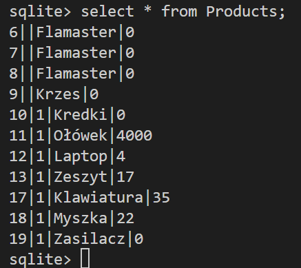

### Podpunkt d)

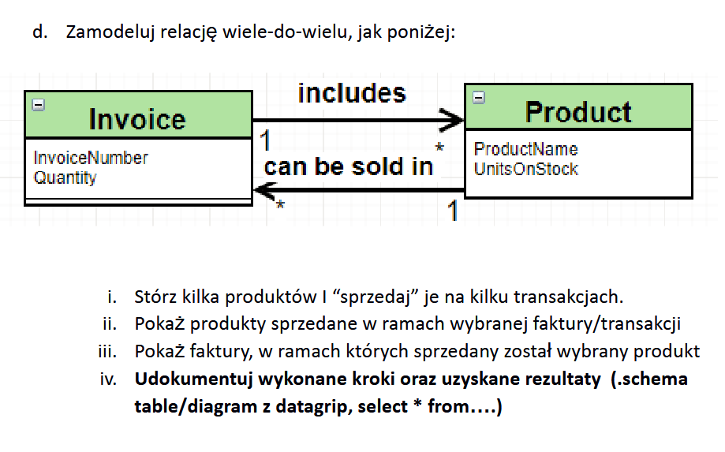

Modyfikacje modelu danych

```cs
// Dodałem klasę faktury
public class Invoice
{
    public int InvoiceID { get; set; }
    public int InvoiceNumber { get; set; }
    public int Quantity { get; set; }
    public ICollection<Product> Includes { get; set; } = [];
}
```

```cs
public class ProdContext : DbContext
{
    public DbSet<Product> Products { get; set; }
    public DbSet<Supplier> Suppliers { get; set; }
    // Dodałem DbSet faktur
    public DbSet<Invoice> Invoices { get; set; }

    protected override void OnConfiguring(DbContextOptionsBuilder optionsBuilder)
    {
        base.OnConfiguring(optionsBuilder);
        optionsBuilder.UseSqlite("Datasource=MyProductDatabase");
    }
}
```

```cs
public class Product
{
    public int ProductID { get; set; }
    public string? ProductName { get; set; }
    public int UnitsInStock { get; set; }
    public Supplier? IsSuppliedBy { get; set; }
    // Dodałem pole tworzące relację
    public ICollection<Invoice> CanBeSoldIn { get; set; } = [];
}
```

Wynik zapytania .schema po dodaniu migracji i aktualizacji bazy danych. Oprócz nowej tabeli Invoice pojawiła się tabela InvoiceProduct modelująca relację wiele do wielu

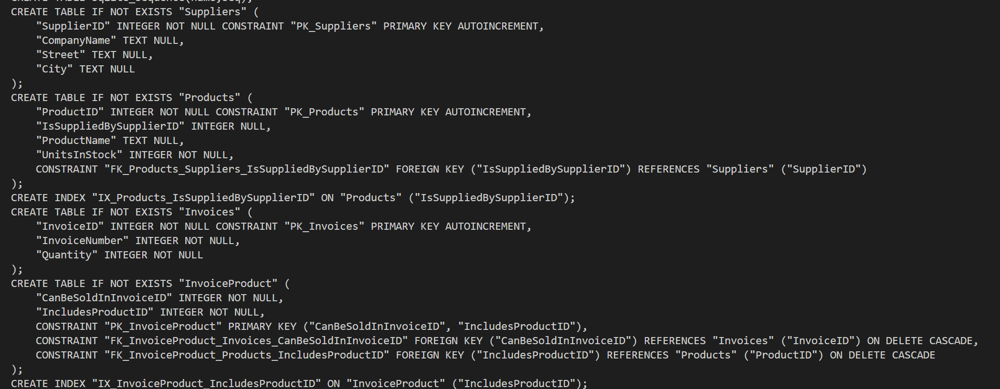

Kod dodający produkty i faktury, znajdujący produkty sprzedane w ramach danej faktury, i faktury, w których sprzedano dany produkt

```cs
var prodContext = new ProdContext();

var tulipan = new Product
{
    ProductName = "Tulipan",
    UnitsInStock = 20,
};
var fiolek = new Product
{
    ProductName = "Fiołek",
    UnitsInStock = 5
};
var storczyk = new Product
{
    ProductName = "Storczyk",
    UnitsInStock = 3
};
var roza = new Product
{
    ProductName = "Róża",
    UnitsInStock = 2
};
prodContext.Products.AddRange(tulipan, fiolek, storczyk, roza);

var invoice1 = new Invoice
{
    InvoiceNumber = 1,
    Includes = [tulipan, fiolek, storczyk, roza]
};
tulipan.CanBeSoldIn.Add(invoice1);
fiolek.CanBeSoldIn.Add(invoice1);
storczyk.CanBeSoldIn.Add(invoice1);
roza.CanBeSoldIn.Add(invoice1);

var invoice2 = new Invoice
{
    InvoiceNumber = 2,
    Includes = [tulipan, fiolek, storczyk]
};
tulipan.CanBeSoldIn.Add(invoice2);
fiolek.CanBeSoldIn.Add(invoice2);
storczyk.CanBeSoldIn.Add(invoice2);

var invoice3 = new Invoice
{
    InvoiceNumber = 3,
    Includes = [tulipan]
};
tulipan.CanBeSoldIn.Add(invoice3);

var invoice4 = new Invoice
{
    InvoiceNumber = 3,
    Includes = [fiolek, roza]
};
fiolek.CanBeSoldIn.Add(invoice4);
roza.CanBeSoldIn.Add(invoice4);

prodContext.Invoices.AddRange(invoice1, invoice2, invoice3, invoice4);
prodContext.SaveChanges();

// Pokazanie produktów sprzedanych w ramach faktury nr. 1
var query1 = from inv in prodContext.Invoices
             where inv.InvoiceNumber == 1
             select inv.Includes;
var products = query1.First();
Console.Write("Produkty sprzedane w ramach faktury nr. 1: ");
foreach (var p in products)
{
    Console.Write(p.ProductName + " ");
}
Console.Write("\n");

// Pokazanie faktur w których sprzedano tulipany
var query2 = from prod in prodContext.Products
             where prod.ProductName == "Tulipan"
             select prod.CanBeSoldIn;
var invoices = query2.First();
Console.Write("Numery faktur, w których sprzedano tulipany: ");
foreach (var i in invoices)
{
    Console.Write(i.InvoiceNumber + " ");
}
```

Wynik działania kodu jest zgodny z oczekiwaniami

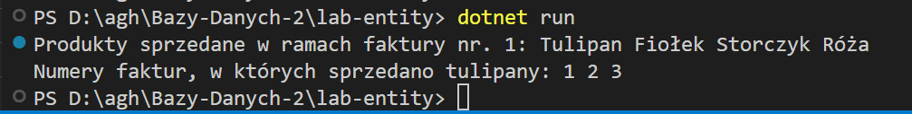

Zmiany są widoczne w bazie danych, w tabeli InvoiceProduct są powiązania nowych produktów z fakturami

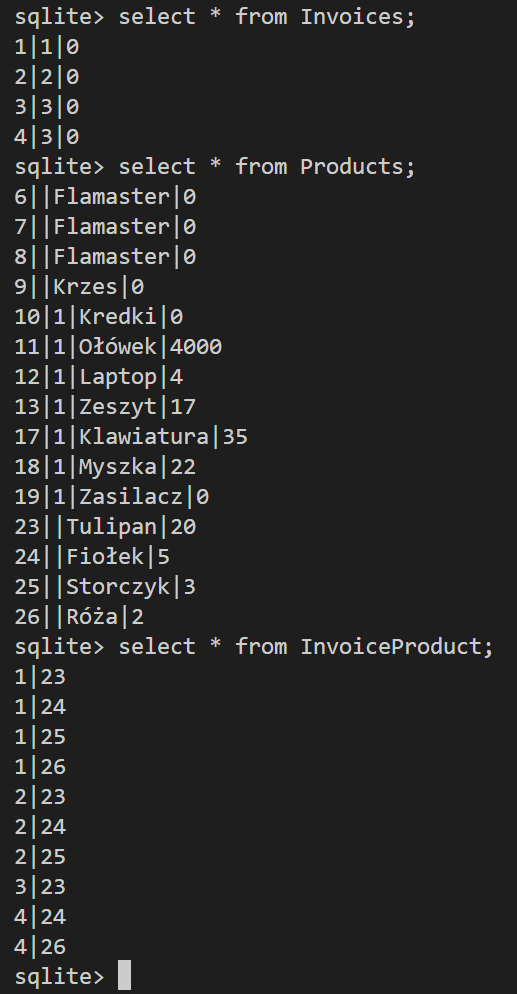

### Podpunkt e)

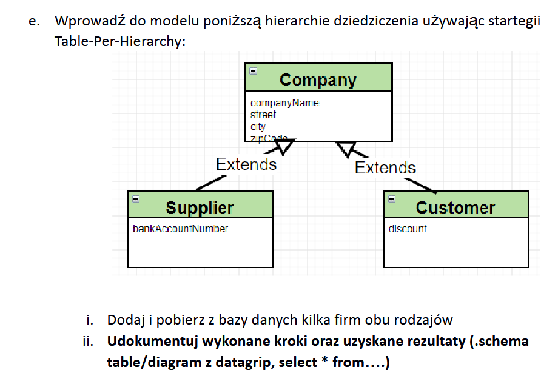

Modyfikacje modelu danych

```cs
// Dodałem klasę firmy
public class Company
{
    public int CompanyID { get; set; }
    public string? CompanyName { get; set; }
    public string? Street { get; set; }
    public string? City { get; set; }
    public string? ZipCode { get; set; }
}
```

```cs
// Dodałem klasę klienta
public class Customer : Company
{
    public double Discount { get; set; }
}
```

```cs
// Zmodyfikowałem klasę dostawcy
public class Supplier : Company
{
    public string? BankAccountNumber { get; set; }
}
```

```cs
public class ProdContext : DbContext
{
    public DbSet<Product> Products { get; set; }
    public DbSet<Invoice> Invoices { get; set; }
    // Dodałem DbSet firm
    public DbSet<Company> Companies { get; set; }
    public DbSet<Supplier> Suppliers { get; set; }
    // Dodałem DbSet klientów
    public DbSet<Customer> Customers { get; set; }

    protected override void OnConfiguring(DbContextOptionsBuilder optionsBuilder)
    {
        base.OnConfiguring(optionsBuilder);
        optionsBuilder.UseSqlite("Datasource=MyProductDatabase");
    }
}
```

Wynik zapytania .schema po dodaniu migracji i aktualizacji bazy danych. W tabeli Companies są kolumny BankAccountNumber i Discount. Znajduje się tam też dodatkowa kolumna Discriminator

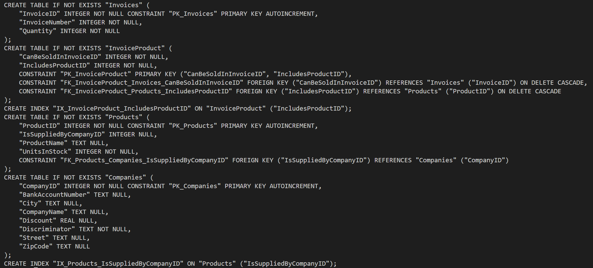

Kod dodający dostawców i klientów, pobierający dane najpierw z całego agregatu Companies, a potem tylko z Suppliers

```cs
using System.Text.Json;

var prodContext = new ProdContext();

var supplier1 = new Supplier
{
    CompanyName = "DHL",
    Street = "Wielicka",
    City = "Kraków",
    BankAccountNumber = "PL91 1378 1462 6908 8595 1014 0748"
};
var supplier2 = new Supplier
{
    CompanyName = "MAERSK",
    Street = "Długa",
    City = "Warszawa",
    BankAccountNumber = "PL37 5269 6062 3118 6527 8335 6401"
};
prodContext.Suppliers.AddRange(supplier1, supplier2);

var customer1 = new Customer
{
    CompanyName = "Wedel",
    Street = "Myślenicka",
    City = "Kraków",
    Discount = 0.05
};
var customer2 = new Customer
{
    CompanyName = "Wedel",
    Street = "Prosta",
    City = "Wrocław",
    Discount = 0.07
};
prodContext.Customers.AddRange(customer1, customer2);

prodContext.SaveChanges();


// Pobranie firmy o danej nazwie z całego agregatu Companies
var query1 = from comp in prodContext.Companies
             where comp.CompanyName == "Wedel"
             select comp;
var company = query1.First();
Console.WriteLine(JsonSerializer.Serialize(company));

// Pobranie dostawcy o danym numberze konta w banku z agregatu Suppliers
var query2 = from supp in prodContext.Suppliers
             where supp.BankAccountNumber == "PL91 1378 1462 6908 8595 1014 0748"
             select supp;
var supplier = query2.First();
Console.WriteLine(JsonSerializer.Serialize(supplier));
```

Wynik działania kodu, jak widać przy pobieraniu danych z prodContext.Companies pole Discount nie jest widoczne

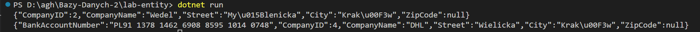

Zmiany są widoczne w bazie danych

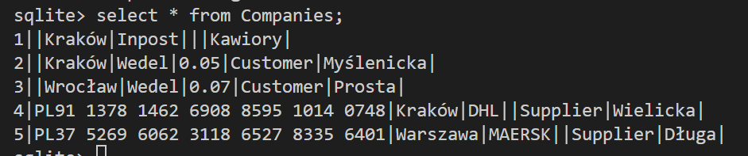

### Podpunkt f) 


Modyfikacje modelu danych

```cs
public class ProdContext : DbContext
{
    public DbSet<Product> Products { get; set; }
    public DbSet<Invoice> Invoices { get; set; }
    public DbSet<Company> Companies { get; set; }
    public DbSet<Supplier> Suppliers { get; set; }
    public DbSet<Customer> Customers { get; set; }

    protected override void OnConfiguring(DbContextOptionsBuilder optionsBuilder)
    {
        base.OnConfiguring(optionsBuilder);
        optionsBuilder.UseSqlite("Datasource=MyProductDatabase");
    }

    // Dodałem przeładowanie OnModelCreating
    protected override void OnModelCreating(ModelBuilder modelBuilder)
    {
        base.OnModelCreating(modelBuilder);
        modelBuilder.Entity<Company>().ToTable("Companies");
        modelBuilder.Entity<Supplier>().ToTable("Suppliers");
        modelBuilder.Entity<Customer>().ToTable("Customers");
    }
}
```

Ze względu na błędy wynikające z relacji musiałem to zadanie wykonać na nowej bazie danych. Wynik zapytania .schema po dodaniu migracji i aktualizacji bazy danych, są osobne tabele Companies, Suppliers i Customers

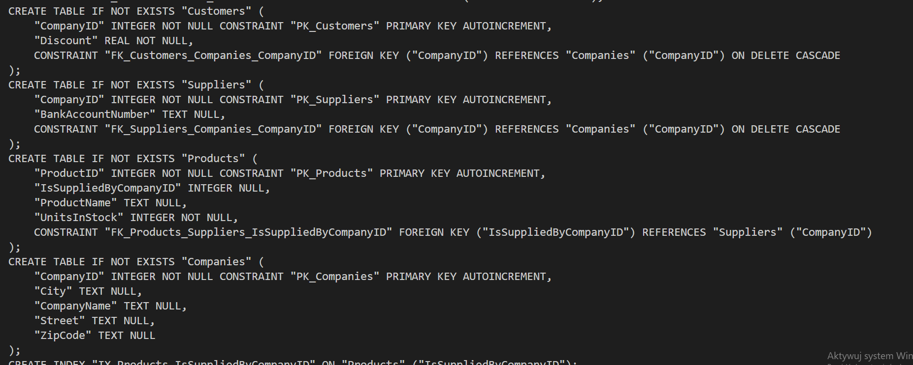

Kod dodający dostawców i klientów, a potem pobierający dane, jest taki sam jak w poprzednim podpunkie. Wynik działania kodu też jest taki sam

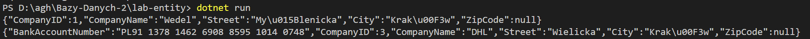

Zmiany są widoczne w bazie danych

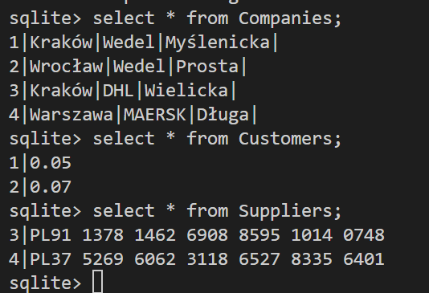

### Podpunkt g)


Z poziomu interakcji z bazą danych poprzez kod obie strategie są identyczne. W strategii TPH mamy tylko jedną tabelę, ale są w niej wartości ustawione na null, co może być problematyczne jeśli dziedziczące klasy mają wiele własnych pól. W strategii TPT nie ma dodatkowych wartości null, ale za to jest wiele tabel, więc przy zapytaniach trzeba używać join-ów, co może je spowalniać.
