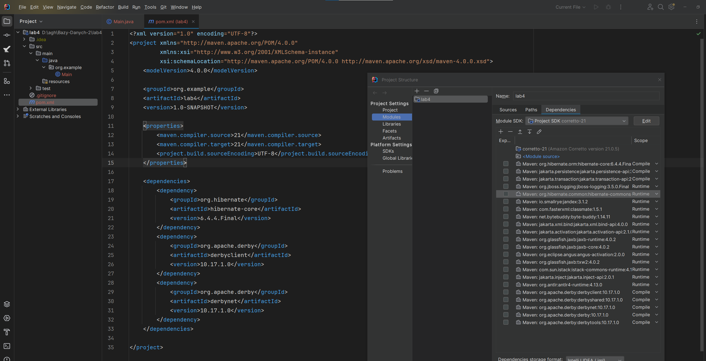
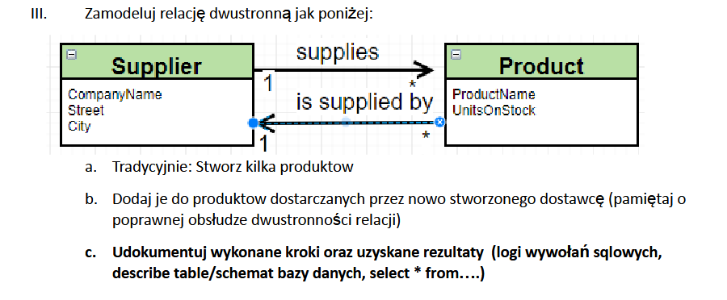
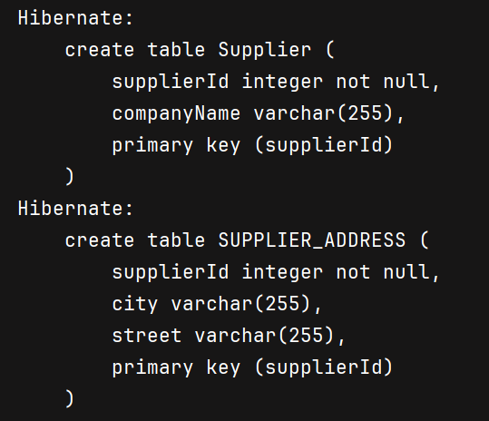
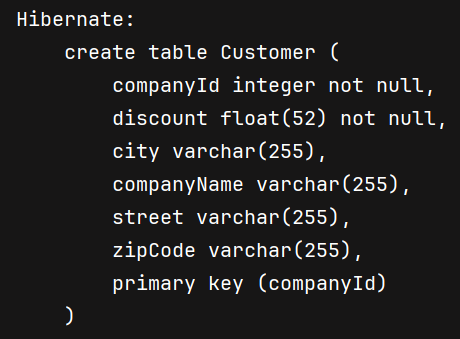

# Sprawozdanie z Hibernate/JPA

## Szymon Żuk

## Część 1

1) Pobrałem i uruchomiłem serwer Derby


2) Utworzyłem projekt


3) Dodałem zależności Hibernate i Apache-Derby


4) Dodałem plik konfiguracyjny Hibernate


5) Po uzupełnieniu klasy Main odpaliłem aplikację


6) Zweryfikowałem bazę danych z pozimu InteliJ


7) Sprawdziłem pusty schemat APP


8) Dodałem klasę produktu, mapping i kod w mainie dodający produkt


9) Odpaliłem aplikację


10) Sprawdziłem, czy produkt został dodany do bazy danych


## Część 2

### Podpunkt 1


Modyfikacje modelu danych

```java
// Dodałem klasę dostawcy (i mapping do niej)
@Entity
public class Supplier {
    @Id
    @GeneratedValue(strategy = GenerationType.AUTO)
    private int supplierId;
    private String companyName;
    private String street;
    private String city;

    public Supplier() {}

    public Supplier(String companyName, String street, String city) {
        this.companyName = companyName;
        this.street = street;
        this.city = city;
    }
}
```

```java
@Entity
public class Product {
    @Id
    @GeneratedValue(strategy = GenerationType.AUTO)
    private int productId;
    private String productName;
    private int unitsInStock;
    // Dodałem pole tworzące relację
    @ManyToOne
    private Supplier isSuppliedBy;

    public Product() {}

    public Product(String productName, int unitsInStock) {
        this.productName = productName;
        this.unitsInStock = unitsInStock;
    }

    // Dodałem setter do pola isSuppliedBy
    public void setIsSuppliedBy(Supplier isSuppliedBy) {
        this.isSuppliedBy = isSuppliedBy;
    }
}
```

Dodałem do maina kod dodający dostawcę, znajdujący wcześniej dodany produkt i ustawiający jego dostawcę na nowo dodanego

```java
tx = session.beginTransaction();
var supplier = new Supplier("Inpost", "Kawiory", "Kraków");
session.save(supplier);
product = session.get(Product.class, 1);
product.setIsSuppliedBy(supplier);
session.save(product);
tx.commit();
```

Wynik działania kodu


Schemat i zawartość bazy danych


### Podpunkt 2


**Wariant z tabelą łącznikową**

Modyfikacje modelu danych

```java
@Entity
public class Product {
    @Id
    @GeneratedValue(strategy = GenerationType.AUTO)
    private int productId;
    private String productName;
    private int unitsInStock;
    // Usunąłęm pole tworzące relację
//    @ManyToOne
//    private Supplier isSuppliedBy;

    public Product() {}

    public Product(String productName, int unitsInStock) {
        this.productName = productName;
        this.unitsInStock = unitsInStock;
    }
    
    // Usunąłęm setter isSuppliedBy
//    public void setIsSuppliedBy(Supplier isSuppliedBy) {
//        this.isSuppliedBy = isSuppliedBy;
//    }
}
```

```java
@Entity
public class Supplier {
    @Id
    @GeneratedValue(strategy = GenerationType.AUTO)
    private int supplierId;
    private String companyName;
    private String street;
    private String city;
    // Dodałem pole tworzące relację
    @OneToMany
    private Set<Product> supplies = new HashSet<>();

    public Supplier() {}

    public Supplier(String companyName, String street, String city) {
        this.companyName = companyName;
        this.street = street;
        this.city = city;
    }

    // Dodałem metodę do dodawania produktu
    public void addSuppliedProduct(Product product) {
        supplies.add(product);
    }
}
```

Usunąłem kod w mainie z poprzedniego podpunktu i dodałem nowy

```java
tx = session.beginTransaction();
var supplier = new Supplier("Inpost", "Kawiory", "Kraków");
product = session.get(Product.class, 1);
supplier.addSuppliedProduct(product);
session.save(supplier);
tx.commit();
```

Wynik działania kodu


Schemat i zawartość bazy danych


**Wariant bez tabeli łącznikowej**

Modyfikacje modelu danych

```java
@Entity
public class Supplier {
    @Id
    @GeneratedValue(strategy = GenerationType.AUTO)
    private int supplierId;
    private String companyName;
    private String street;
    private String city;
    @OneToMany
    // Dodałem JoinColumn
    @JoinColumn(name="SUPPLIER_FK")
    private Set<Product> supplies = new HashSet<>();

    public Supplier() {}

    public Supplier(String companyName, String street, String city) {
        this.companyName = companyName;
        this.street = street;
        this.city = city;
    }

    // Dodałem metodę do dodawania produktu
    public void addSuppliedProduct(Product product) {
        supplies.add(product);
    }
}
```

Kod w mainie zostawiłem taki sam jak w poprzednim wariancie. W wyniku działania kodu pojawił się klucz obcy


Schemat i zawartość bazy danych


### Podpunkt 3


Modyfikacje modelu danych

```java
@Entity
public class Product {
    @Id
    @GeneratedValue(strategy = GenerationType.AUTO)
    private int productId;
    private String productName;
    private int unitsInStock;
    // Dodałem pole tworzące relację z JoinColumn
    @ManyToOne
    // Nazwa JoinColumn taka sama jak w Supplier
    @JoinColumn(name="SUPPLIER_FK")
    private Supplier isSuppliedBy;

    public Product() {}

    public Product(String productName, int unitsInStock) {
        this.productName = productName;
        this.unitsInStock = unitsInStock;
    }

    // Znów dodałem setter isSuppliedBy
    public void setIsSuppliedBy(Supplier isSuppliedBy) {
        this.isSuppliedBy = isSuppliedBy;
    }
}
```

Usunąłem kod w mainie z poprzedniego podpunktu i dodałem nowy

```java
tx = session.beginTransaction();
var supplier = new Supplier("Inpost", "Kawiory", "Kraków");
product = session.get(Product.class, 1);
product.setIsSuppliedBy(supplier);
supplier.addSuppliedProduct(product);
session.save(supplier);
tx.commit();
```

Wynik działania kodu


Schemat i zawartość bazy danych są takie same jak w podpunkcie 2 z wariantem bez tabeli łącznikowej


### Podpunkt 4


Modyfikacje modelu danych

```java
// Dodałem klasę kategorii (i jej mapping)
@Entity
public class Category {
    @Id
    @GeneratedValue(strategy = GenerationType.AUTO)
    private int categoryId;
    private String categoryName;
    @OneToMany
    @JoinColumn(name="CATEGORY_FK")
    private List<Product> products = new ArrayList<>();

    public Category() {}

    public Category(String categoryName, List<Product> products) {
        this.categoryName = categoryName;
        this.products = products;
    }

    public void addProduct(Product product) {
        products.add(product);
    }

    public List<Product> getProducts() {
        return products;
    }
}
```

```java
@Entity
public class Product {
    @Id
    @GeneratedValue(strategy = GenerationType.AUTO)
    private int productId;
    private String productName;
    private int unitsInStock;
    @ManyToOne
    @JoinColumn(name="SUPPLIER_FK")
    private Supplier isSuppliedBy;
    // Dodałem pole tworzące relację
    @ManyToOne
    @JoinColumn(name="CATEGORY_FK")
    private Category category;

    /* ... */

    // Dodałem setter kategorii
    public void setCategory(Category category) {
        this.category = category;
    }

    // Dodałem getter do wypisania danych w konsoli
    public String getProductName() {
        return productName;
    }
}
```

Usunąłem wszystko co było wcześniej w mainie i dodałem nowy kod, który dodaje produkty i kategorie, a potem wydobywa produkty z wybranej kategorii

```java
var sessionFactory = getSessionFactory();
var session = sessionFactory.openSession();
var tx = session.beginTransaction();

var klawiatura = new Product("Klawiatura", 25);
var myszka = new Product("Myszka", 22);
var zasilacz = new Product("Zasilacz", 0);

var tulipan = new Product("Tulipan", 20);
var storczyk = new Product("Storczyk", 3);

var buty = new Product("Buty", 2);
var spodnie = new Product("Spodnie", 15);

var peryferia = new Category(
    "Peryferia",
    List.of(klawiatura, myszka, zasilacz)
);
klawiatura.setCategory(peryferia);
myszka.setCategory(peryferia);
zasilacz.setCategory(peryferia);
session.save(klawiatura);
session.save(myszka);
session.save(zasilacz);
session.save(peryferia);

var kwiaty = new Category(
    "Kwiaty",
    List.of(tulipan, storczyk)
);
tulipan.setCategory(kwiaty);
storczyk.setCategory(kwiaty);
session.save(tulipan);
session.save(storczyk);
session.save(kwiaty);

var ubrania = new Category(
    "Ubrania",
    List.of(buty, spodnie)
);
buty.setCategory(ubrania);
spodnie.setCategory(ubrania);
session.save(buty);
session.save(spodnie);
session.save(ubrania);

tx.commit();

tx = session.beginTransaction();
var query = session.createQuery("from Category as cat where cat.categoryName='Ubrania'");
var kategoria = (Category) query.getSingleResult();
System.out.println("Produkty z kategorii Ubrania:");
for (var p : kategoria.getProducts()) {
    System.out.println(p.getProductName());
}
tx.commit();

session.close();
```

Wynik działania kodu


Schemat i zawartość bazy danych


### Podpunkt 5


Modyfikacje modelu danych

```java
// Dodałem klasę faktury
@Entity
public class Invoice {
    @Id
    @GeneratedValue(strategy = GenerationType.AUTO)
    private int invoiceId;
    private int invoiceNumber;
    private int quantity;
    @ManyToMany
    private Set<Product> includes = new HashSet<>();

    public Invoice() {}

    public Invoice(int invoiceNumber, int quantity, Set<Product> includes) {
        this.invoiceNumber = invoiceNumber;
        this.quantity = quantity;
        this.includes = includes;
    }

    public Set<Product> getIncludes() {
        return includes;
    }

    public int getInvoiceNumber() {
        return invoiceNumber;
    }
}
```

```java
@Entity
public class Product {
    @Id
    @GeneratedValue(strategy = GenerationType.AUTO)
    private int productId;
    private String productName;
    private int unitsInStock;
    @ManyToOne
    @JoinColumn(name="SUPPLIER_FK")
    private Supplier isSuppliedBy;
    @ManyToOne
    @JoinColumn(name="CATEGORY_FK")
    private Category category;
    // Dodałem pole tworzące relację many-to-many
    @ManyToMany(mappedBy="includes")
    private Set<Invoice> canBeSoldIn = new HashSet<>();

    /* ... */

    // Dodałem metodę do dodawania faktury
    public void addCanBeSoldIn(Invoice invoice) {
        canBeSoldIn.add(invoice);
    }

    // Dodałem getter do wypisania faktur
    public Set<Invoice> getCanBeSoldIn() {
        return canBeSoldIn;
    }
}
```

Usunąłem wszystko co było wcześniej w mainie i dodałem nowy kod, który dodaje produkty i faktury, znajduje produkty sprzedane w ramach danej faktury, i faktury, w których sprzedano dany produkt

```java
var sessionFactory = getSessionFactory();
var session = sessionFactory.openSession();
var tx = session.beginTransaction();

var tulipan = new Product("Tulipan", 20);
var fiolek = new Product("Fiołek", 5);
var storczyk = new Product("Storczyk", 3);
var roza = new Product("Róża", 3);

var invoice1 = new Invoice(1, 4, Set.of(tulipan, fiolek, storczyk, roza));
tulipan.addCanBeSoldIn(invoice1);
fiolek.addCanBeSoldIn(invoice1);
storczyk.addCanBeSoldIn(invoice1);
roza.addCanBeSoldIn(invoice1);

var invoice2 = new Invoice(2, 3, Set.of(tulipan, fiolek, storczyk));
tulipan.addCanBeSoldIn(invoice2);
fiolek.addCanBeSoldIn(invoice2);
storczyk.addCanBeSoldIn(invoice2);

var invoice3 = new Invoice(3, 1, Set.of(tulipan));
tulipan.addCanBeSoldIn(invoice3);

var invoice4 = new Invoice(4, 1, Set.of(fiolek, roza));
fiolek.addCanBeSoldIn(invoice4);
roza.addCanBeSoldIn(invoice4);

session.save(tulipan);
session.save(fiolek);
session.save(storczyk);
session.save(roza);

session.save(invoice1);
session.save(invoice2);
session.save(invoice3);
session.save(invoice4);

tx.commit();

// Pokazanie produktów sprzedanych w ramach faktury nr. 1
tx = session.beginTransaction();
var query1 = session.createQuery("from Invoice as inv where inv.invoiceNumber=1");
var faktura = (Invoice) query1.getSingleResult();

// Pokazanie faktur w których sprzedano tulipany
var query2 = session.createQuery("from Product as prod where prod.productName='Tulipan'");
var produkt = (Product) query2.getSingleResult();

System.out.print("Produkty sprzedane w ramach faktury nr 1: ");
for (var p : faktura.getIncludes()) {
    System.out.print(p.getProductName() + " ");
}
System.out.print("\n");

System.out.print("Numery faktur, w których sprzedano tulipany: ");
for (var i : produkt.getCanBeSoldIn()) {
    System.out.print(i.getInvoiceNumber() + " ");
}
tx.commit();

session.close();
```

Wynik działania kodu


Schemat i zawartość bazy danych


### Podpunkt 6


Dodałem plik META-INF/persistence.xml


Napisałem nowego maina, kod ma analogiczne działanie jak w poprzednim podpunkcie

```java
public class MainJPA {

    public static void main(String[] args) {
        var emf = Persistence.createEntityManagerFactory("SzymonZukDatabase");
        var em = emf.createEntityManager();
        var etx = em.getTransaction();
        etx.begin();

        var tulipan = new Product("Tulipan", 20);
        var fiolek = new Product("Fiołek", 5);
        var storczyk = new Product("Storczyk", 3);
        var roza = new Product("Róża", 3);

        var invoice1 = new Invoice(1, 4, Set.of(tulipan, fiolek, storczyk, roza));
        tulipan.addCanBeSoldIn(invoice1);
        fiolek.addCanBeSoldIn(invoice1);
        storczyk.addCanBeSoldIn(invoice1);
        roza.addCanBeSoldIn(invoice1);

        var invoice2 = new Invoice(2, 3, Set.of(tulipan, fiolek, storczyk));
        tulipan.addCanBeSoldIn(invoice2);
        fiolek.addCanBeSoldIn(invoice2);
        storczyk.addCanBeSoldIn(invoice2);

        var invoice3 = new Invoice(3, 1, Set.of(tulipan));
        tulipan.addCanBeSoldIn(invoice3);

        var invoice4 = new Invoice(4, 1, Set.of(fiolek, roza));
        fiolek.addCanBeSoldIn(invoice4);
        roza.addCanBeSoldIn(invoice4);

        em.persist(tulipan);
        em.persist(fiolek);
        em.persist(storczyk);
        em.persist(roza);

        em.persist(invoice1);
        em.persist(invoice2);
        em.persist(invoice3);
        em.persist(invoice4);

        etx.commit();

        // Pokazanie produktów sprzedanych w ramach faktury nr. 1
        etx = em.getTransaction();
        etx.begin();

        var query1 = em.createQuery("from Invoice as inv where inv.invoiceNumber=1");
        var faktura = (Invoice) query1.getSingleResult();

        // Pokazanie faktur w których sprzedano tulipany
        var query2 = em.createQuery("from Product as prod where prod.productName='Tulipan'");
        var produkt = (Product) query2.getSingleResult();

        System.out.print("Produkty sprzedane w ramach faktury nr 1: ");
        for (var p : faktura.getIncludes()) {
            System.out.print(p.getProductName() + " ");
        }
        System.out.print("\n");

        System.out.print("Numery faktur, w których sprzedano tulipany: ");
        for (var i : produkt.getCanBeSoldIn()) {
            System.out.print(i.getInvoiceNumber() + " ");
        }
        etx.commit();

        em.close();
    }

}
```

Wynik jest identyczny jak wcześniej


Schemat i zawartość bazy danych też jest identyczna


### Podpunkt 7


Modyfikacje modelu danych

```java
@Entity
public class Product {
    @Id
    @GeneratedValue(strategy = GenerationType.AUTO)
    private int productId;
    private String productName;
    private int unitsInStock;
    @ManyToOne
    @JoinColumn(name="SUPPLIER_FK")
    private Supplier isSuppliedBy;
    @ManyToOne
    @JoinColumn(name="CATEGORY_FK")
    private Category category;
    // Dodałem cascade
    @ManyToMany(mappedBy="includes", cascade = CascadeType.PERSIST)
    private Set<Invoice> canBeSoldIn = new HashSet<>();

    /* ... */

}
```

```java
@Entity
public class Invoice {
    @Id
    @GeneratedValue(strategy = GenerationType.AUTO)
    private int invoiceId;
    private int invoiceNumber;
    private int quantity;
    // Dodałem cascade
    @ManyToMany(cascade = CascadeType.PERSIST)
    private Set<Product> includes = new HashSet<>();

    /* ... */

}
```

W mainie napisałem kod tworzący faktury wraz z nowymi produktami (bez zapisywania explicite) i odwrotnie

```java
public static void main(String[] args) {
    var emf = Persistence.createEntityManagerFactory("SzymonZukDatabase");
    var em = emf.createEntityManager();
    var etx = em.getTransaction();
    etx.begin();

    var tulipan = new Product("Tulipan", 20);
    var fiolek = new Product("Fiołek", 5);

    var invoice1 = new Invoice(1, 2, Set.of(tulipan, fiolek));
    tulipan.addCanBeSoldIn(invoice1);
    fiolek.addCanBeSoldIn(invoice1);

    em.persist(invoice1);

    var storczyk = new Product("Storczyk", 3);

    var invoice2 = new Invoice(2, 1, Set.of(storczyk));
    var invoice3 = new Invoice(3, 1, Set.of(storczyk));
    storczyk.addCanBeSoldIn(invoice2);
    storczyk.addCanBeSoldIn(invoice3);

    em.persist(storczyk);

    etx.commit();

    em.close();
}
```

Po uruchomieniu aplikacji wszystkie produkty i faktury zostały poprawnie zapisane w bazie danych


### Podpunkt 8


Najpierw zrobiłem wariant z mapowaniem do osobnych tabel, bo wymagał mniejszej ilości modyfikacji

**Wariant z mapowaniem do osobnych tabel**

Modyfikacje modelu danych

```java
@Entity
// Dodałem tabelę adresów
@SecondaryTable(name="SUPPLIER_ADDRESS")
public class Supplier {
    @Id
    @GeneratedValue(strategy = GenerationType.AUTO)
    private int supplierId;
    private String companyName;
    // Zmapowałem street i city na tabelę adresów
    @Column(table="SUPPLIER_ADDRESS")
    private String street;
    @Column(table="SUPPLIER_ADDRESS")
    private String city;
    @OneToMany
    @JoinColumn(name="SUPPLIER_FK")
    private Set<Product> supplies = new HashSet<>();

    /* ... */

}
```

Napisałem kod w mainie tworzący dwóch dostawców

```java
var emf = Persistence.createEntityManagerFactory("SzymonZukDatabase");
var em = emf.createEntityManager();
var etx = em.getTransaction();
etx.begin();

var supplier1 = new Supplier("Inpost", "Kawiory", "Kraków");
var supplier2 = new Supplier("DHL", "Myślenicka", "Warszawa");

em.persist(supplier1);
em.persist(supplier2);

etx.commit();
em.close();
```

W wyniku działania kodu została utworzona tabela adresów


Schemat i zawartość bazy danych


**Wariant z wbudowaną klasą**

Modyfikacje modelu danych

```java
// Dodałem klasę Address (i mapping do niej)
@Embeddable
public class Address {
    private String city;
    private String street;

    public Address() {}

    public Address(String city, String street) {
        this.city = city;
        this.street = street;
    }
}
```

```java
@Entity
// Usunąłem tabelę adresów
// @SecondaryTable(name="SUPPLIER_ADDRESS")
public class Supplier {
    @Id
    @GeneratedValue(strategy = GenerationType.AUTO)
    private int supplierId;
    private String companyName;
    // Usunąłem pola związane z adresem
    // @Column(table="SUPPLIER_ADDRESS")
    // private String street;
    // @Column(table="SUPPLIER_ADDRESS")
    // private String city;
    @OneToMany
    @JoinColumn(name="SUPPLIER_FK")
    private Set<Product> supplies = new HashSet<>();
    // Dodałem wbudowane pole adresu
    @Embedded
    private Address address;

    public Supplier() {}

    // Zmodyfikowałem konstruktor, tak aby przyjmował klasę adresu
    public Supplier(String companyName, Address address) {
        this.companyName = companyName;
        this.address = address;
    }

    public void addSuppliedProduct(Product product) {
        supplies.add(product);
    }
}
```

Zmodyfikowałem kod w mainie tworzący dwóch dostawców

```java
var emf = Persistence.createEntityManagerFactory("SzymonZukDatabase");
var em = emf.createEntityManager();
var etx = em.getTransaction();
etx.begin();

var address1 = new Address("Kawiory", "Kraków");
var address2 = new Address("Myślenicka", "Warszawa");

var supplier1 = new Supplier("Inpost", address1);
var supplier2 = new Supplier("DHL", address2);

em.persist(supplier1);
em.persist(supplier2);

etx.commit();
em.close();
```

Po uruchomieniu aplikacji stworzyła się tabela dostawców zawierająca dane adresowe (czyli odwrotnie jak w poprzednim wariancie)


Zawartość tabeli suppliers


### Podpunkt 9


**Wariant z jedną tabelą**

Modyfikacje modelu danych

```java
// Dodałem klasę firmy
@Entity
@Inheritance(strategy=InheritanceType.SINGLE_TABLE)
public class Company {
    @Id
    @GeneratedValue(strategy = GenerationType.AUTO)
    protected int companyId;
    protected String companyName;
    protected String city;
    protected String street;
    protected String zipCode;

    public Company() {}

    public Company(String companyName, String city, String street, String zipCode) {
        this.companyName = companyName;
        this.city = city;
        this.street = street;
        this.zipCode = zipCode;
    }

    @Override
    public String toString() {
        return "Company(CompanyId: " + companyId + ", CompanyName: " +
            companyName + ", City: " + city + ", Street: "
            + street + ", ZipCode: " + zipCode + ")";
    }
}
```

```java
// Zmodyfikowałem klasę dostawcy wprowadzając dziedziczenie z firmy
@Entity
public class Supplier extends Company {
    private String bankAccountNumber;

    public Supplier() {}

    public Supplier(String companyName, String city, String street, String zipCode, String bankAccountNumber) {
        super(companyName, city, street, zipCode);
        this.bankAccountNumber = bankAccountNumber;
    }

    @Override
    public String toString() {
        return "Supplier(CompanyId: " + companyId + ", CompanyName: " +
            companyName + ", City: " + city + ", Street: "
            + street + ", ZipCode: " + zipCode + ", BankAccountNumber: " + bankAccountNumber + ")";
    }
}
```

```java
// Dodałem klasę klienta
@Entity
public class Customer extends Company {
    private double discount;

    public Customer() {}

    public Customer(String companyName, String city, String street, String zipCode, double discount) {
        super(companyName, city, street, zipCode);
        this.discount = discount;
    }

    @Override
    public String toString() {
        return "Customer(CompanyId: " + companyId + ", CompanyName: " +
            companyName + ", City: " + city + ", Street: "
            + street + ", ZipCode: " + zipCode + ", Discount: " + discount + ")";
    }
}
```

Napisałem kod w mainie dodający dostawców i klientów, a następnie wydobywający ich z bazy danych z dziedziczących agregatów i z agregatu Company

```java
public static void main(String[] args) {
    var emf = Persistence.createEntityManagerFactory("SzymonZukDatabase");
    var em = emf.createEntityManager();
    var etx = em.getTransaction();
    etx.begin();

    var supplier1 = new Supplier("Inpost", "Kraków", "Kawiory", "00-123",
        "PL37 5269 6062 3118 6527 8335 6401");
    var supplier2 = new Supplier("DHL", "Warszawa", "Myślenicka", "13-125",
        "PL91 1378 1462 6908 8595 1014 0748");

    var customer1 = new Customer("Wedel", "Radom", "Łużycka", "72-244", 0.05);
    var customer2 = new Customer("Milka", "Kraków", "Basztowa", "82-214", 0.05);

    em.persist(supplier1);
    em.persist(supplier2);
    em.persist(customer1);
    em.persist(customer2);

    var query1 = em.createQuery("from Supplier as s " +
        "where s.bankAccountNumber='PL91 1378 1462 6908 8595 1014 0748'", Supplier.class);

    var query2 = em.createQuery("from Customer as c where c.zipCode='72-244'", Customer.class);

    var query3 = em.createQuery("from Company as c where c.city='Kraków'", Company.class);

    var supplier = query1.getSingleResult();
    var customer = query2.getSingleResult();
    var companies = query3.getResultList();

    System.out.println("Dostawca z numerem konta w banku PL91 1378 1462 6908 8595 1014 0748:");
    System.out.println(supplier);
    System.out.println("Klient z kodem pocztowym 13-125:");
    System.out.println(customer);
    System.out.println("Firmy z Krakowa:");
    for (var c : companies) {
        System.out.println(c);
    }

    etx.commit();
    em.close();
}
```

Wynik działania kodu


Struktura tabeli i jej zawartość w bazie danych


**Wariant z tabelami łączonymi**

Modyfikacje modelu danych

```java
@Entity
// Zmieniłem InheritanceType na JOINED
@Inheritance(strategy=InheritanceType.JOINED)
public class Company {
    
    /* ... */

}
```

Nie zmieniałem kodu w mainie. Otrzymałem ten sam wynik w zapytaniach wydobywających obiekt z bazy danych co wcześniej. Zmieniła się struktura tworzonych tabel


Schemat bazy danych i jej zawartość


**Wariant z jedną tabelą na każdą klasę**

Modyfikacje modelu danych

```java
@Entity
// Zmieniłem InheritanceType na TABLE_PER_CLASS
@Inheritance(strategy=InheritanceType.TABLE_PER_CLASS)
public class Company {
    
    /* ... */

}
```

Znów nie zmieniałem kodu w mainie. Otrzymałem ten sam wynik w zapytaniach wydobywających obiekt z bazy danych co wcześniej. Zmieniła się struktura tworzonych tabel





Schemat bazy danych i jej zawartość. Jak widać tabela Company jest pusta, bo każda stworzona firma była dostawcą lub klientem 

